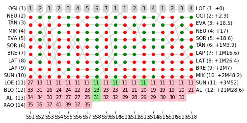

# Rally Report - Spain

*This report is unofficial and is not associated in any way with the Fédération Internationale de l’Automobile (FIA) or WRC Promoter GmbH.*

RallyRACC Catalunya - Rally de España (2018-10-25 to 2018-10-28) runs over 18 competitive special stages. The distance covered on the special stages is 331.58km, with an overall rally distance of 1495.73km. The special stage surface type is predominantly .

