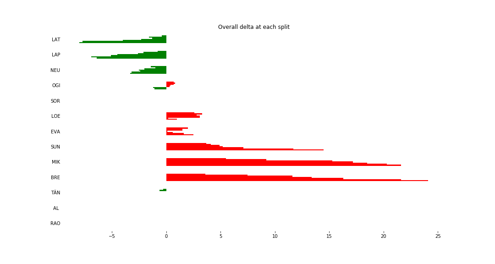

# Stage Overall Split Delta Chart - Spain, 2018 - SOR - SS10

# Stage Within Split Delta Chart - Spain, 2018 - SOR - SS10

# Stage Progress Chart - Spain, 2018 - SOR - SS10

|Driver|            Team             |Elapsed Duration|Position|Class Rank|   diffFirst    |    diffPrev    |
|------|-----------------------------|----------------|-------:|---------:|----------------|----------------|
|LAT   |TOYOTA GAZOO RACING WRT      |00:12:58.4000000|       1|         1|00:00:00        |00:00:00        |
|LAP   |TOYOTA GAZOO RACING WRT      |00:13:00        |       2|         2|00:00:01.6000000|00:00:01.6000000|
|NEU   |HYUNDAI SHELL MOBIS WRT      |00:13:03.1000000|       3|         3|00:00:04.7000000|00:00:03.1000000|
|OGI   |M-SPORT FORD WORLD RALLY TEAM|00:13:05.3000000|       4|         4|00:00:06.9000000|00:00:02.2000000|
|SOR   |HYUNDAI SHELL MOBIS WRT      |00:13:06.4000000|       5|         5|00:00:08        |00:00:01.1000000|
|LOE   |CITROËN  TOTAL ABU DHABI WRT |00:13:07.4000000|       6|         6|00:00:09        |00:00:01        |
|EVA   |M-SPORT FORD WORLD RALLY TEAM|00:13:08.9000000|       7|         7|00:00:10.5000000|00:00:01.5000000|
|SUN   |M-SPORT FORD WORLD RALLY TEAM|00:13:20.9000000|       8|         8|00:00:22.5000000|00:00:12        |
|MIK   |HYUNDAI SHELL MOBIS WRT      |00:13:28        |       9|         9|00:00:29.6000000|00:00:07.1000000|
|BRE   |CITROËN TOTAL ABU DHABI  WRT |00:13:30.5000000|      10|        10|00:00:32.1000000|00:00:02.5000000|
|TÄN   |TOYOTA GAZOO RACING WRT      |00:14:41.4000000|      28|        11|00:01:43        |00:00:14        |
|AL    |CITROËN TOTAL ABU DHABI  WRT |00:15:00.2000000|      29|        12|00:02:01.8000000|00:00:18.8000000|
|RAO   |JEAN-MICHEL RAOUX            |00:15:26.1000000|      30|        13|00:02:27.7000000|00:00:25.9000000|

