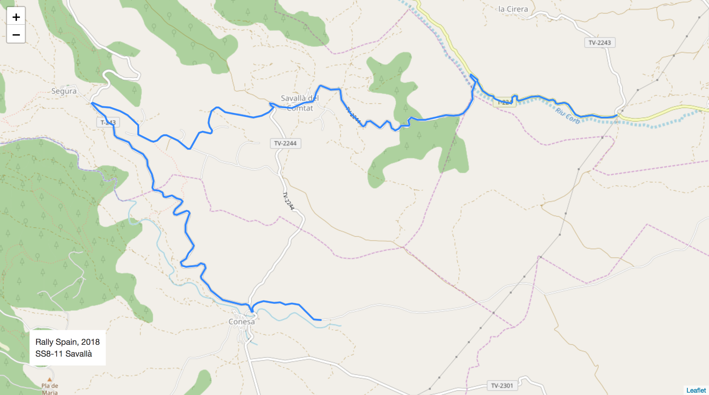
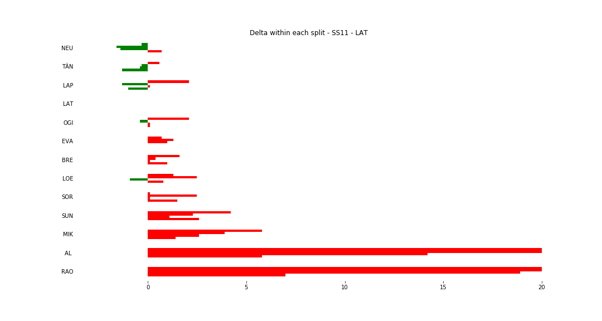
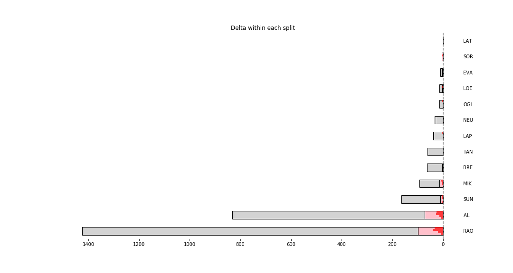

# Stage Map - Spain, 2018 - SS11

# Stage Overall Split Delta Chart - Spain, 2018 - LAT - SS11

# Stage Within Split Delta Chart - Spain, 2018 - LAT - SS11

# Stage Progress Chart - Spain, 2018 - LAT - SS11

|Driver|            Team             |Elapsed Duration|Position|Class Rank|   diffFirst    |    diffPrev    |
|------|-----------------------------|----------------|-------:|---------:|----------------|----------------|
|NEU   |HYUNDAI SHELL MOBIS WRT      |00:07:47.1000000|       1|         1|00:00:00        |00:00:00        |
|TÄN   |TOYOTA GAZOO RACING WRT      |00:07:48.3000000|       2|         2|00:00:01.2000000|00:00:01.2000000|
|LAP   |TOYOTA GAZOO RACING WRT      |00:07:49.5000000|       3|         3|00:00:02.4000000|00:00:01.2000000|
|LAT   |TOYOTA GAZOO RACING WRT      |00:07:49.7000000|       4|         4|00:00:02.6000000|00:00:00.2000000|
|OGI   |M-SPORT FORD WORLD RALLY TEAM|00:07:51.6000000|       5|         5|00:00:04.5000000|00:00:01.9000000|
|EVA   |M-SPORT FORD WORLD RALLY TEAM|00:07:52.7000000|       6|         6|00:00:05.6000000|00:00:01.1000000|
|BRE   |CITROËN TOTAL ABU DHABI  WRT |00:07:52.8000000|       7|         7|00:00:05.7000000|00:00:00.1000000|
|LOE   |CITROËN  TOTAL ABU DHABI WRT |00:07:53.4000000|       8|         8|00:00:06.3000000|00:00:00.6000000|
|SOR   |HYUNDAI SHELL MOBIS WRT      |00:07:53.9000000|       9|         9|00:00:06.8000000|00:00:00.5000000|
|SUN   |M-SPORT FORD WORLD RALLY TEAM|00:07:59.9000000|      10|        10|00:00:12.8000000|00:00:06        |
|MIK   |HYUNDAI SHELL MOBIS WRT      |00:08:03.4000000|      11|        11|00:00:16.3000000|00:00:03.5000000|
|AL    |CITROËN TOTAL ABU DHABI  WRT |00:09:02.6000000|      27|        12|00:01:15.5000000|00:00:27.8000000|
|RAO   |JEAN-MICHEL RAOUX            |00:09:27.8000000|      34|        13|00:01:40.7000000|00:00:00.9000000|

