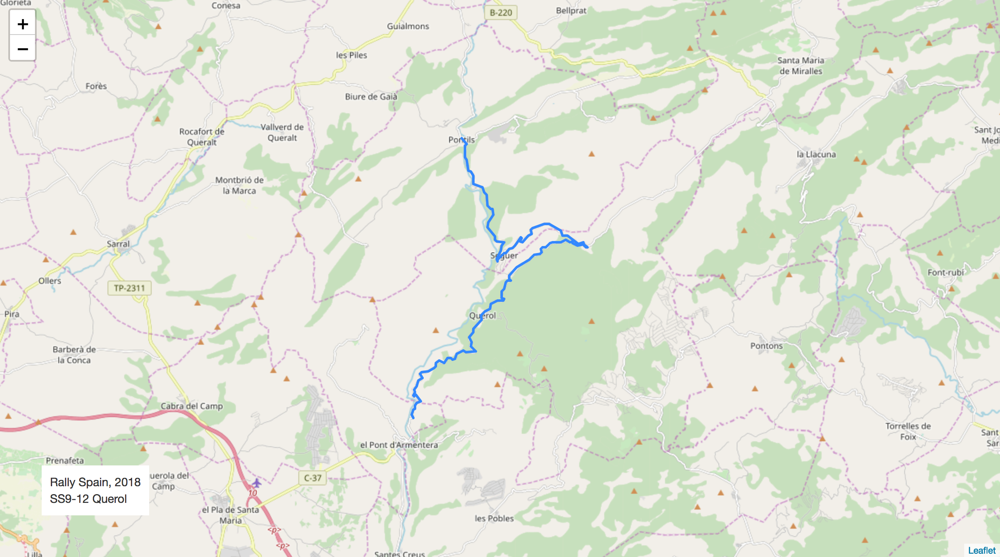

# Stage Map - Spain, 2018 - SS12

# Stage Overall Split Delta Chart - Spain, 2018 - LAT - SS12

# Stage Within Split Delta Chart - Spain, 2018 - LAT - SS12

# Stage Progress Chart - Spain, 2018 - LAT - SS12

|Driver|            Team             |Elapsed Duration|Position|Class Rank|   diffFirst    |    diffPrev    |
|------|-----------------------------|----------------|-------:|---------:|----------------|----------------|
|LOE   |CITROËN  TOTAL ABU DHABI WRT |00:11:25.8000000|       1|         1|00:00:00        |00:00:00        |
|NEU   |HYUNDAI SHELL MOBIS WRT      |00:11:26.4000000|       2|         2|00:00:00.6000000|00:00:00.6000000|
|LAP   |TOYOTA GAZOO RACING WRT      |00:11:31.1000000|       3|         3|00:00:05.3000000|00:00:04.7000000|
|LAT   |TOYOTA GAZOO RACING WRT      |00:11:32.8000000|       4|         4|00:00:07        |00:00:01.7000000|
|TÄN   |TOYOTA GAZOO RACING WRT      |00:11:33.2000000|       5|         5|00:00:07.4000000|00:00:00.4000000|
|EVA   |M-SPORT FORD WORLD RALLY TEAM|00:11:33.3000000|       6|         6|00:00:07.5000000|00:00:00.1000000|
|OGI   |M-SPORT FORD WORLD RALLY TEAM|00:11:33.5000000|       7|         7|00:00:07.7000000|00:00:00.2000000|
|SOR   |HYUNDAI SHELL MOBIS WRT      |00:11:33.6000000|       8|         8|00:00:07.8000000|00:00:00.1000000|
|MIK   |HYUNDAI SHELL MOBIS WRT      |00:11:55.8000000|       9|         9|00:00:30        |00:00:22.2000000|
|SUN   |M-SPORT FORD WORLD RALLY TEAM|00:12:01.1000000|      10|        10|00:00:35.3000000|00:00:05.3000000|
|BRE   |CITROËN TOTAL ABU DHABI  WRT |00:12:02.3000000|      11|        11|00:00:36.5000000|00:00:01.2000000|
|AL    |CITROËN TOTAL ABU DHABI  WRT |00:13:23.3000000|      27|        12|00:01:57.5000000|00:00:06.5000000|
|RAO   |JEAN-MICHEL RAOUX            |00:13:35.7000000|      30|        13|00:02:09.9000000|00:00:03.4000000|

