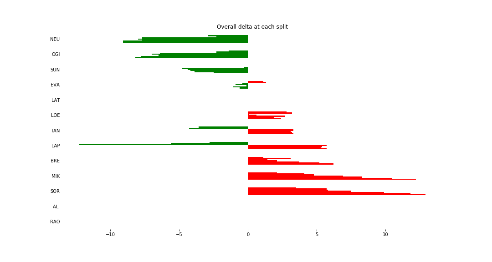

# Stage Map - Spain, 2018 - SS13

# Stage Overall Split Delta Chart - Spain, 2018 - LAT - SS13

# Stage Within Split Delta Chart - Spain, 2018 - LAT - SS13

# Stage Progress Chart - Spain, 2018 - LAT - SS13

|Driver|            Team             |Elapsed Duration|Position|Class Rank|   diffFirst    |    diffPrev    |
|------|-----------------------------|----------------|-------:|---------:|----------------|----------------|
|NEU   |HYUNDAI SHELL MOBIS WRT      |00:13:07.3000000|       1|         1|00:00:00        |00:00:00        |
|OGI   |M-SPORT FORD WORLD RALLY TEAM|00:13:08.2000000|       2|         2|00:00:00.9000000|00:00:00.9000000|
|SUN   |M-SPORT FORD WORLD RALLY TEAM|00:13:13.9000000|       3|         3|00:00:06.6000000|00:00:05.7000000|
|EVA   |M-SPORT FORD WORLD RALLY TEAM|00:13:15.8000000|       4|         4|00:00:08.5000000|00:00:01.9000000|
|LAT   |TOYOTA GAZOO RACING WRT      |00:13:16.4000000|       5|         5|00:00:09.1000000|00:00:00.6000000|
|LOE   |CITROËN  TOTAL ABU DHABI WRT |00:13:18.8000000|       6|         6|00:00:11.5000000|00:00:02.4000000|
|TÄN   |TOYOTA GAZOO RACING WRT      |00:13:19.7000000|       7|         7|00:00:12.4000000|00:00:00.9000000|
|LAP   |TOYOTA GAZOO RACING WRT      |00:13:22.1000000|       8|         8|00:00:14.8000000|00:00:02.4000000|
|BRE   |CITROËN TOTAL ABU DHABI  WRT |00:13:22.6000000|       9|         9|00:00:15.3000000|00:00:00.5000000|
|MIK   |HYUNDAI SHELL MOBIS WRT      |00:13:28.6000000|      10|        10|00:00:21.3000000|00:00:06        |
|SOR   |HYUNDAI SHELL MOBIS WRT      |00:13:29.3000000|      11|        11|00:00:22        |00:00:00.7000000|
|AL    |CITROËN TOTAL ABU DHABI  WRT |00:15:09.4000000|      26|        12|00:02:02.1000000|00:00:45        |
|RAO   |JEAN-MICHEL RAOUX            |00:16:12.3000000|      32|        13|00:03:05        |00:00:01.5000000|

