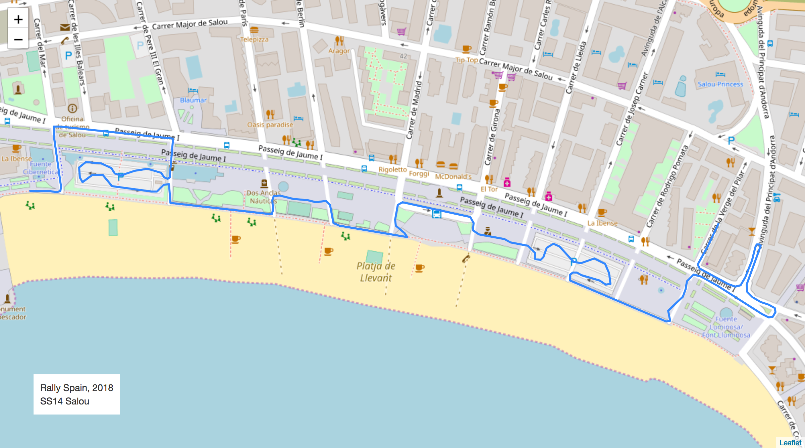
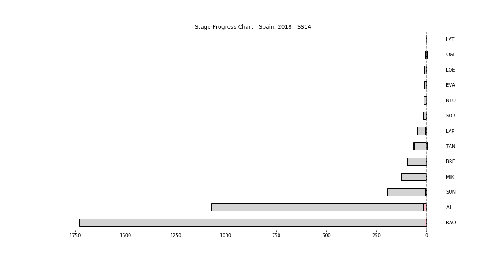

# Stage Map - Spain, 2018 - SS14

# Stage Progress Chart - Spain, 2018 - LAT - SS14

|Driver|            Team             |Elapsed Duration|Position|Class Rank|   diffFirst    |    diffPrev    |
|------|-----------------------------|----------------|-------:|---------:|----------------|----------------|
|TÄN   |TOYOTA GAZOO RACING WRT      |00:02:41.9000000|       1|         1|00:00:00        |00:00:00        |
|OGI   |M-SPORT FORD WORLD RALLY TEAM|00:02:42.8000000|       3|         2|00:00:00.9000000|00:00:00.8000000|
|LOE   |CITROËN  TOTAL ABU DHABI WRT |00:02:43.4000000|       4|         3|00:00:01.5000000|00:00:00.6000000|
|EVA   |M-SPORT FORD WORLD RALLY TEAM|00:02:43.9000000|       7|         4|00:00:02        |00:00:00.2000000|
|NEU   |HYUNDAI SHELL MOBIS WRT      |00:02:44        |       8|         5|00:00:02.1000000|00:00:00.1000000|
|SOR   |HYUNDAI SHELL MOBIS WRT      |00:02:44.2000000|       9|         6|00:00:02.3000000|00:00:00.2000000|
|MIK   |HYUNDAI SHELL MOBIS WRT      |00:02:44.3000000|      10|         7|00:00:02.4000000|00:00:00.1000000|
|LAT   |TOYOTA GAZOO RACING WRT      |00:02:45.3000000|      14|         8|00:00:03.4000000|00:00:00.1000000|
|BRE   |CITROËN TOTAL ABU DHABI  WRT |00:02:45.4000000|      15|         9|00:00:03.5000000|00:00:00.1000000|
|LAP   |TOYOTA GAZOO RACING WRT      |00:02:50.2000000|      21|        10|00:00:08.3000000|00:00:01.4000000|
|SUN   |M-SPORT FORD WORLD RALLY TEAM|00:02:50.6000000|      22|        11|00:00:08.7000000|00:00:00.4000000|
|RAO   |JEAN-MICHEL RAOUX            |00:02:53.9000000|      25|        12|00:00:12        |00:00:00.4000000|
|AL    |CITROËN TOTAL ABU DHABI  WRT |00:03:02.1000000|      28|        13|00:00:20.2000000|00:00:00.8000000|

