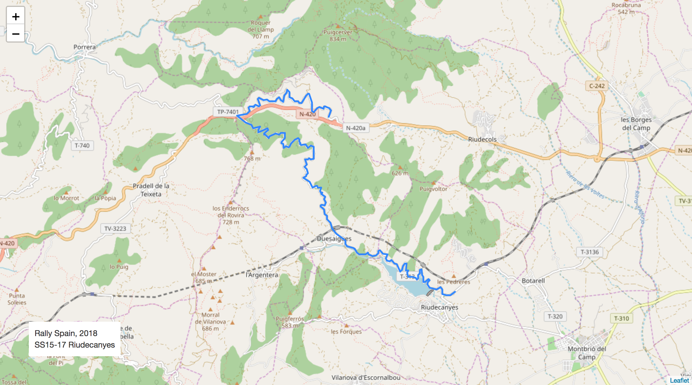
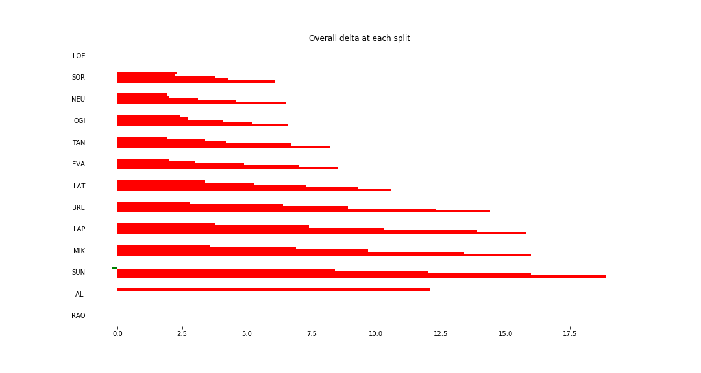
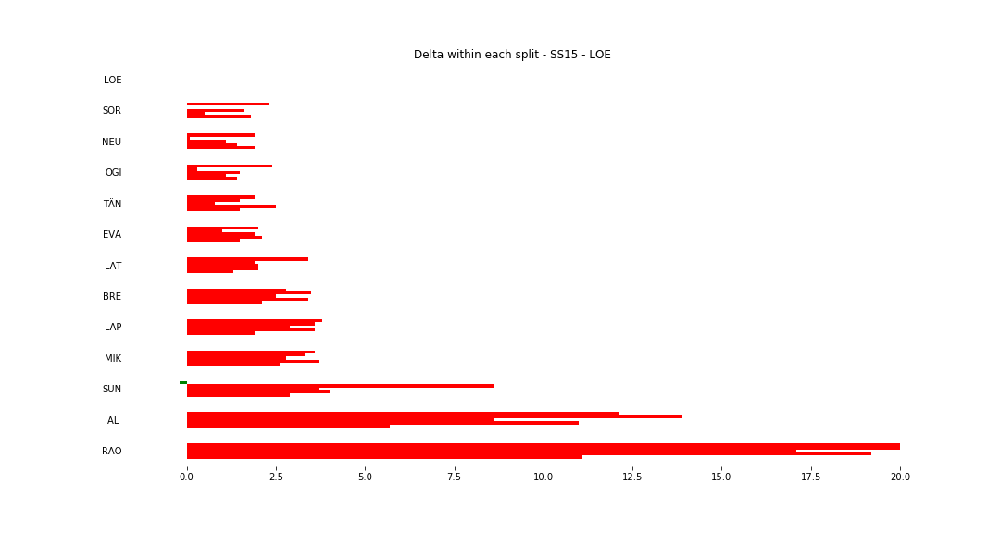
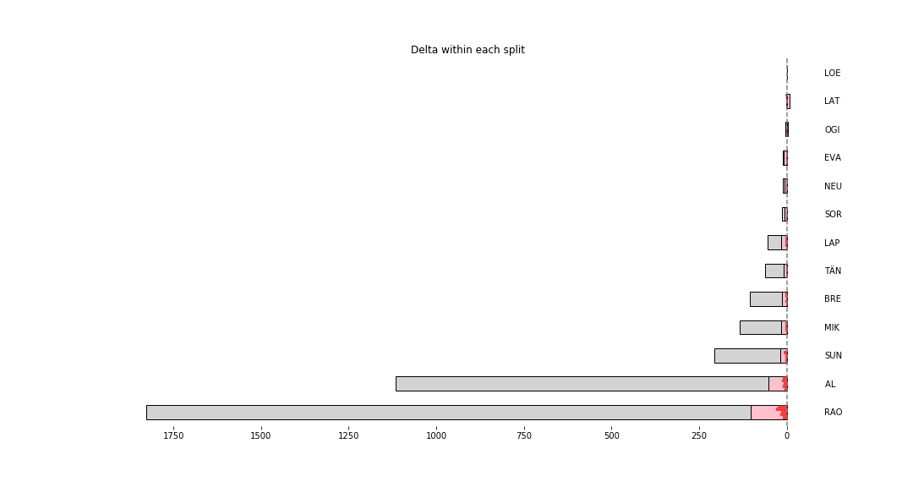

# Stage Map - Spain, 2018 - SS15

# Stage Overall Split Delta Chart - Spain, 2018 - LOE - SS15

# Stage Within Split Delta Chart - Spain, 2018 - LOE - SS15

# Stage Progress Chart - Spain, 2018 - LOE - SS15

|Driver|            Team             |Elapsed Duration|Position|Class Rank|   diffFirst    |    diffPrev    |
|------|-----------------------------|----------------|-------:|---------:|----------------|----------------|
|LOE   |CITROËN  TOTAL ABU DHABI WRT |00:10:22.6000000|       1|         1|00:00:00        |00:00:00        |
|SOR   |HYUNDAI SHELL MOBIS WRT      |00:10:28.7000000|       2|         2|00:00:06.1000000|00:00:06.1000000|
|NEU   |HYUNDAI SHELL MOBIS WRT      |00:10:29.1000000|       3|         3|00:00:06.5000000|00:00:00.4000000|
|OGI   |M-SPORT FORD WORLD RALLY TEAM|00:10:29.2000000|       4|         4|00:00:06.6000000|00:00:00.1000000|
|TÄN   |TOYOTA GAZOO RACING WRT      |00:10:30.8000000|       5|         5|00:00:08.2000000|00:00:01.6000000|
|EVA   |M-SPORT FORD WORLD RALLY TEAM|00:10:31.1000000|       6|         6|00:00:08.5000000|00:00:00.3000000|
|LAT   |TOYOTA GAZOO RACING WRT      |00:10:33.2000000|       7|         7|00:00:10.6000000|00:00:02.1000000|
|BRE   |CITROËN TOTAL ABU DHABI  WRT |00:10:37        |       8|         8|00:00:14.4000000|00:00:03.8000000|
|LAP   |TOYOTA GAZOO RACING WRT      |00:10:38.4000000|       9|         9|00:00:15.8000000|00:00:01.4000000|
|MIK   |HYUNDAI SHELL MOBIS WRT      |00:10:38.6000000|      10|        10|00:00:16        |00:00:00.2000000|
|SUN   |M-SPORT FORD WORLD RALLY TEAM|00:10:41.5000000|      11|        11|00:00:18.9000000|00:00:02.9000000|
|AL    |CITROËN TOTAL ABU DHABI  WRT |00:11:13.9000000|      25|        12|00:00:51.3000000|00:00:05.8000000|
|RAO   |JEAN-MICHEL RAOUX            |00:12:06.4000000|      35|        13|00:01:43.8000000|00:00:06.2000000|

