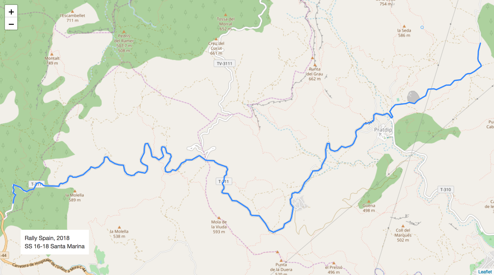
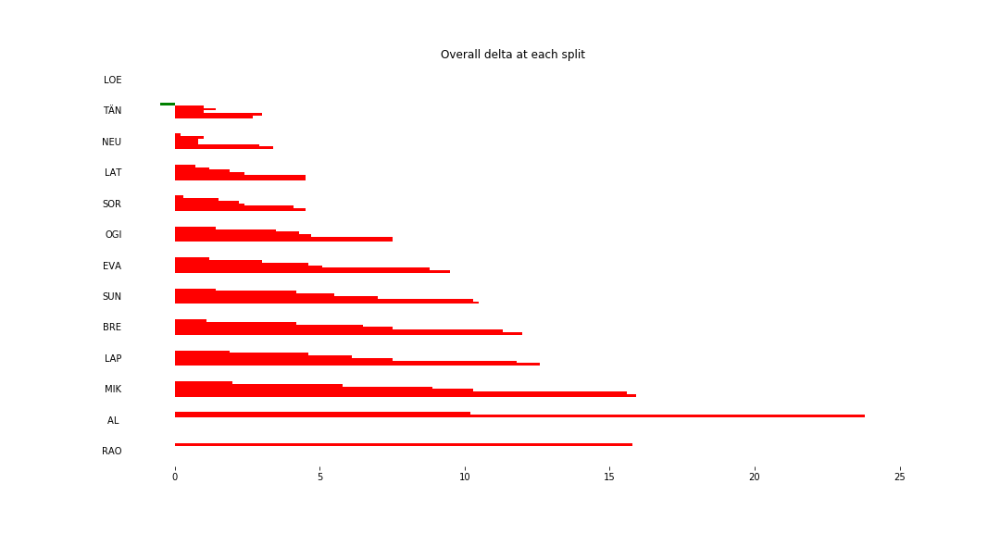
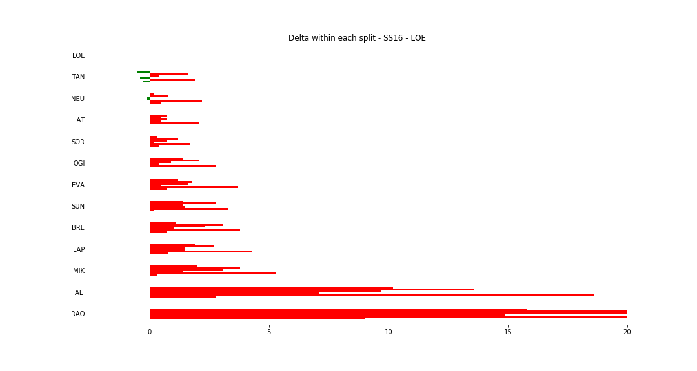
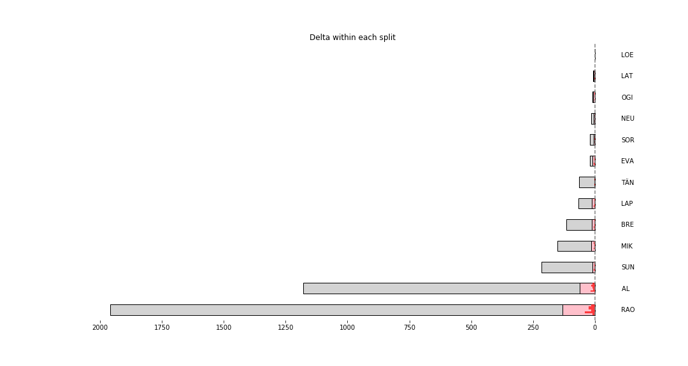

# Stage Map - Spain, 2018 - SS16

# Stage Overall Split Delta Chart - Spain, 2018 - LOE - SS16

# Stage Within Split Delta Chart - Spain, 2018 - LOE - SS16

# Stage Progress Chart - Spain, 2018 - LOE - SS16

|Driver|            Team             |Elapsed Duration|Position|Class Rank|   diffFirst    |    diffPrev    |
|------|-----------------------------|----------------|-------:|---------:|----------------|----------------|
|LOE   |CITROËN  TOTAL ABU DHABI WRT |00:08:08.9000000|       1|         1|00:00:00        |00:00:00        |
|TÄN   |TOYOTA GAZOO RACING WRT      |00:08:11.6000000|       2|         2|00:00:02.7000000|00:00:02.7000000|
|NEU   |HYUNDAI SHELL MOBIS WRT      |00:08:12.3000000|       3|         3|00:00:03.4000000|00:00:00.7000000|
|SOR   |HYUNDAI SHELL MOBIS WRT      |00:08:13.4000000|       4|         4|00:00:04.5000000|00:00:01.1000000|
|LAT   |TOYOTA GAZOO RACING WRT      |00:08:13.4000000|       5|         5|00:00:04.5000000|00:00:00        |
|OGI   |M-SPORT FORD WORLD RALLY TEAM|00:08:16.4000000|       6|         6|00:00:07.5000000|00:00:03        |
|EVA   |M-SPORT FORD WORLD RALLY TEAM|00:08:18.4000000|       7|         7|00:00:09.5000000|00:00:02        |
|SUN   |M-SPORT FORD WORLD RALLY TEAM|00:08:19.4000000|       8|         8|00:00:10.5000000|00:00:01        |
|BRE   |CITROËN TOTAL ABU DHABI  WRT |00:08:20.9000000|       9|         9|00:00:12        |00:00:01.5000000|
|LAP   |TOYOTA GAZOO RACING WRT      |00:08:21.5000000|      10|        10|00:00:12.6000000|00:00:00.6000000|
|MIK   |HYUNDAI SHELL MOBIS WRT      |00:08:24.8000000|      11|        11|00:00:15.9000000|00:00:03.3000000|
|AL    |CITROËN TOTAL ABU DHABI  WRT |00:09:10.9000000|      29|        12|00:01:02        |00:00:02.1000000|
|RAO   |JEAN-MICHEL RAOUX            |00:10:20.3000000|      44|        13|00:02:11.4000000|00:00:01.1000000|

