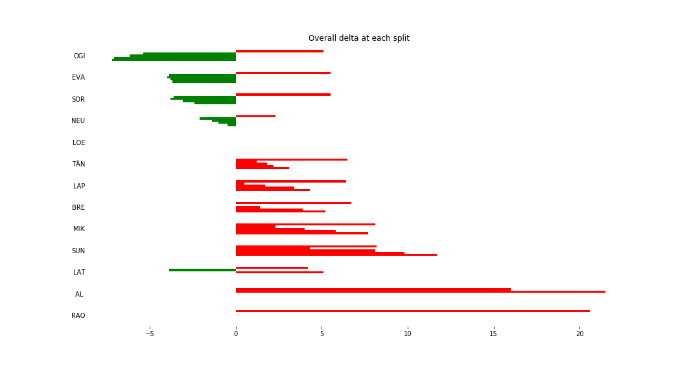
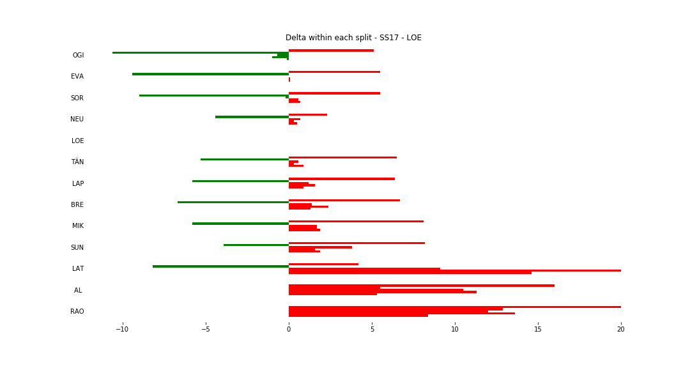
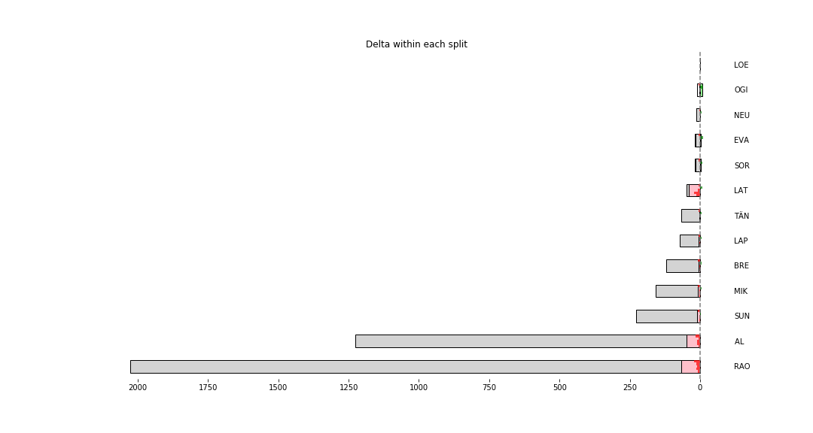

# Stage Map - Spain, 2018 - SS17

# Stage Overall Split Delta Chart - Spain, 2018 - LOE - SS17

# Stage Within Split Delta Chart - Spain, 2018 - LOE - SS17

# Stage Progress Chart - Spain, 2018 - LOE - SS17

|Driver|            Team             |Elapsed Duration|Position|Class Rank|   diffFirst    |    diffPrev    |
|------|-----------------------------|----------------|-------:|---------:|----------------|----------------|
|OGI   |M-SPORT FORD WORLD RALLY TEAM|00:10:14.2000000|       1|         1|00:00:00        |00:00:00        |
|EVA   |M-SPORT FORD WORLD RALLY TEAM|00:10:17.7000000|       2|         2|00:00:03.5000000|00:00:03.5000000|
|SOR   |HYUNDAI SHELL MOBIS WRT      |00:10:19        |       3|         3|00:00:04.8000000|00:00:01.3000000|
|NEU   |HYUNDAI SHELL MOBIS WRT      |00:10:20.9000000|       4|         4|00:00:06.7000000|00:00:01.9000000|
|LOE   |CITROËN  TOTAL ABU DHABI WRT |00:10:21.4000000|       5|         5|00:00:07.2000000|00:00:00.5000000|
|TÄN   |TOYOTA GAZOO RACING WRT      |00:10:24.5000000|       6|         6|00:00:10.3000000|00:00:03.1000000|
|LAP   |TOYOTA GAZOO RACING WRT      |00:10:25.7000000|       7|         7|00:00:11.5000000|00:00:01.2000000|
|BRE   |CITROËN TOTAL ABU DHABI  WRT |00:10:26.6000000|       8|         8|00:00:12.4000000|00:00:00.9000000|
|MIK   |HYUNDAI SHELL MOBIS WRT      |00:10:29.1000000|       9|         9|00:00:14.9000000|00:00:02.5000000|
|SUN   |M-SPORT FORD WORLD RALLY TEAM|00:10:33.1000000|      10|        10|00:00:18.9000000|00:00:04        |
|LAT   |TOYOTA GAZOO RACING WRT      |00:11:02.3000000|      19|        11|00:00:48.1000000|00:00:09.7000000|
|AL    |CITROËN TOTAL ABU DHABI  WRT |00:11:10.1000000|      21|        12|00:00:55.9000000|00:00:07.8000000|

