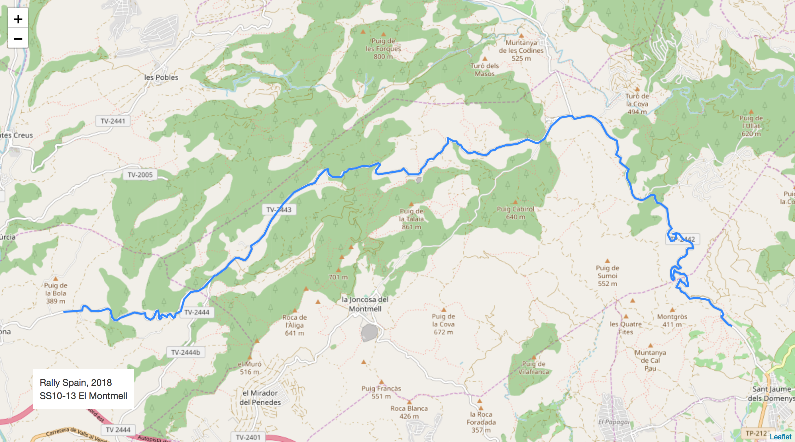
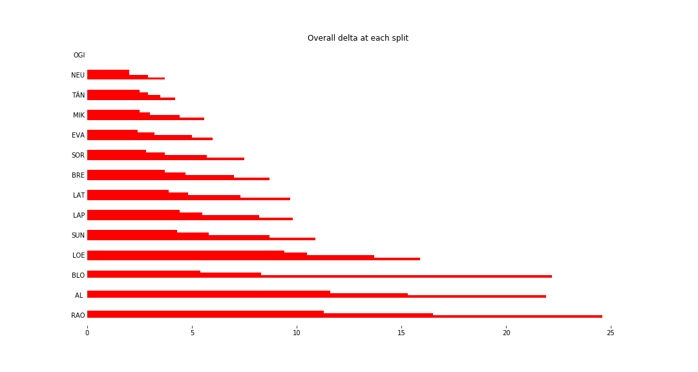
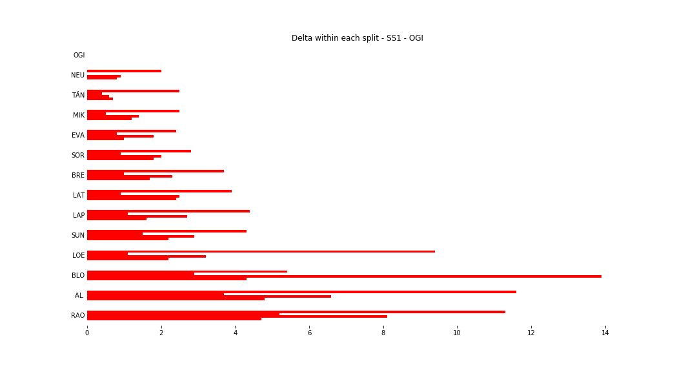
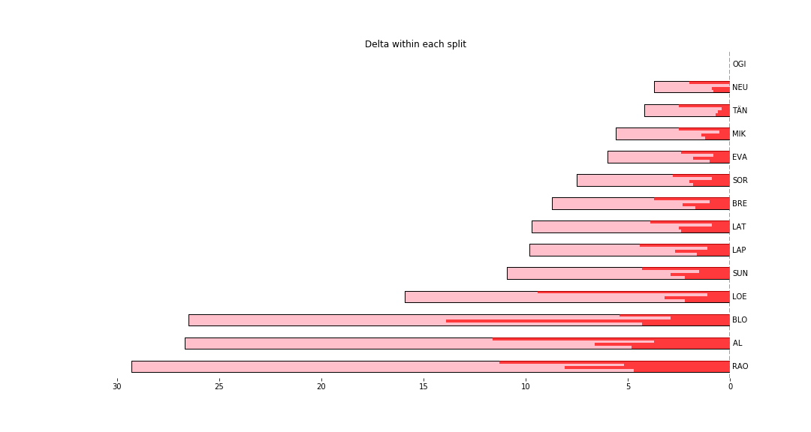

# Stage Map - Spain, 2018 - SS1

# Stage Overall Split Delta Chart - Spain, 2018 - OGI - SS1

# Stage Within Split Delta Chart - Spain, 2018 - OGI - SS1

# Stage Progress Chart - Spain, 2018 - OGI - SS1

|Driver|            Team             |Elapsed Duration|Position|Class Rank|   diffFirst    |    diffPrev    |
|------|-----------------------------|----------------|-------:|---------:|----------------|----------------|
|OGI   |M-SPORT FORD WORLD RALLY TEAM|00:03:35.3000000|       1|         1|00:00:00        |00:00:00        |
|NEU   |HYUNDAI SHELL MOBIS WRT      |00:03:39        |       2|         2|00:00:03.7000000|00:00:03.7000000|
|TÄN   |TOYOTA GAZOO RACING WRT      |00:03:39.5000000|       3|         3|00:00:04.2000000|00:00:00.5000000|
|MIK   |HYUNDAI SHELL MOBIS WRT      |00:03:40.9000000|       4|         4|00:00:05.6000000|00:00:01.4000000|
|EVA   |M-SPORT FORD WORLD RALLY TEAM|00:03:41.3000000|       5|         5|00:00:06        |00:00:00.4000000|
|SOR   |HYUNDAI SHELL MOBIS WRT      |00:03:42.8000000|       7|         6|00:00:07.5000000|00:00:00.1000000|
|BRE   |CITROËN TOTAL ABU DHABI  WRT |00:03:44        |       9|         7|00:00:08.7000000|00:00:00.1000000|
|LAT   |TOYOTA GAZOO RACING WRT      |00:03:45        |      11|         8|00:00:09.7000000|00:00:00.7000000|
|LAP   |TOYOTA GAZOO RACING WRT      |00:03:45.1000000|      12|         9|00:00:09.8000000|00:00:00.1000000|
|SUN   |M-SPORT FORD WORLD RALLY TEAM|00:03:46.2000000|      14|        10|00:00:10.9000000|00:00:00.8000000|
|LOE   |CITROËN  TOTAL ABU DHABI WRT |00:03:51.2000000|      27|        11|00:00:15.9000000|00:00:00.1000000|
|BLO   |HOONIGAN RACING              |00:04:01.8000000|      33|        12|00:00:26.5000000|00:00:02.6000000|
|AL    |CITROËN TOTAL ABU DHABI  WRT |00:04:02        |      34|        13|00:00:26.7000000|00:00:00.2000000|
|RAO   |JEAN-MICHEL RAOUX            |00:04:04.6000000|      35|        14|00:00:29.3000000|00:00:02.6000000|

