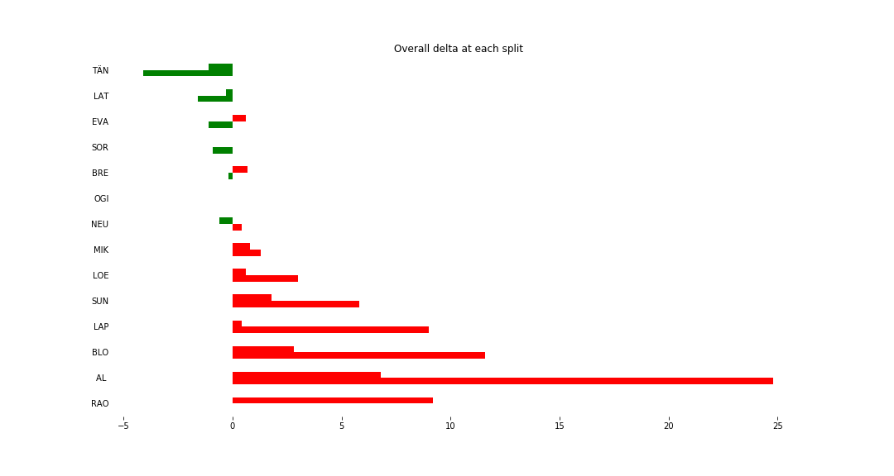
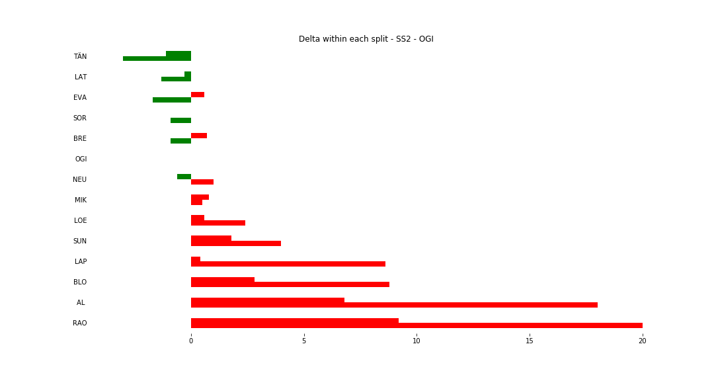
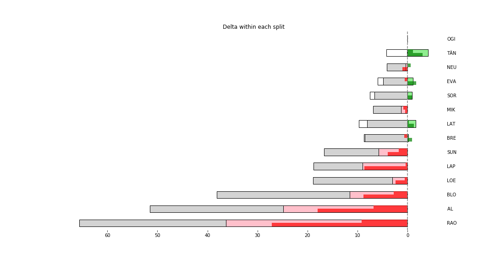

# Stage Map - Spain, 2018 - SS2

# Stage Overall Split Delta Chart - Spain, 2018 - OGI - SS2

# Stage Within Split Delta Chart - Spain, 2018 - OGI - SS2

# Stage Progress Chart - Spain, 2018 - OGI - SS2

|Driver|            Team             |Elapsed Duration|Position|Class Rank|   diffFirst    |    diffPrev    |
|------|-----------------------------|----------------|-------:|---------:|----------------|----------------|
|TÄN   |TOYOTA GAZOO RACING WRT      |00:04:19.6000000|       1|         1|00:00:00        |00:00:00        |
|LAT   |TOYOTA GAZOO RACING WRT      |00:04:22.1000000|       2|         2|00:00:02.5000000|00:00:02.5000000|
|EVA   |M-SPORT FORD WORLD RALLY TEAM|00:04:22.6000000|       3|         3|00:00:03        |00:00:00.5000000|
|SOR   |HYUNDAI SHELL MOBIS WRT      |00:04:22.8000000|       4|         4|00:00:03.2000000|00:00:00.2000000|
|BRE   |CITROËN TOTAL ABU DHABI  WRT |00:04:23.5000000|       5|         5|00:00:03.9000000|00:00:00.7000000|
|OGI   |M-SPORT FORD WORLD RALLY TEAM|00:04:23.7000000|       6|         6|00:00:04.1000000|00:00:00.2000000|
|NEU   |HYUNDAI SHELL MOBIS WRT      |00:04:24.1000000|       7|         7|00:00:04.5000000|00:00:00.4000000|
|MIK   |HYUNDAI SHELL MOBIS WRT      |00:04:25        |       8|         8|00:00:05.4000000|00:00:00.9000000|
|LOE   |CITROËN  TOTAL ABU DHABI WRT |00:04:26.7000000|       9|         9|00:00:07.1000000|00:00:01.7000000|
|SUN   |M-SPORT FORD WORLD RALLY TEAM|00:04:29.5000000|      10|        10|00:00:09.9000000|00:00:02.8000000|
|LAP   |TOYOTA GAZOO RACING WRT      |00:04:32.7000000|      14|        11|00:00:13.1000000|00:00:01        |
|BLO   |HOONIGAN RACING              |00:04:35.3000000|      18|        12|00:00:15.7000000|00:00:00.2000000|
|AL    |CITROËN TOTAL ABU DHABI  WRT |00:04:48.5000000|      33|        13|00:00:28.9000000|00:00:00.1000000|
|RAO   |JEAN-MICHEL RAOUX            |00:05:00        |      35|        14|00:00:40.4000000|00:00:09.5000000|

