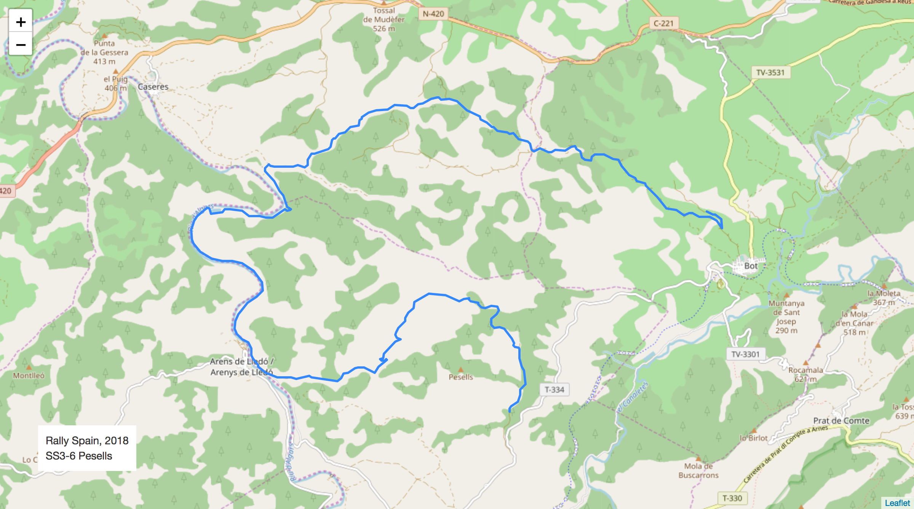
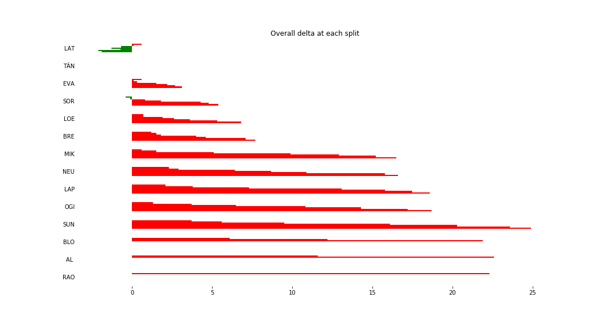
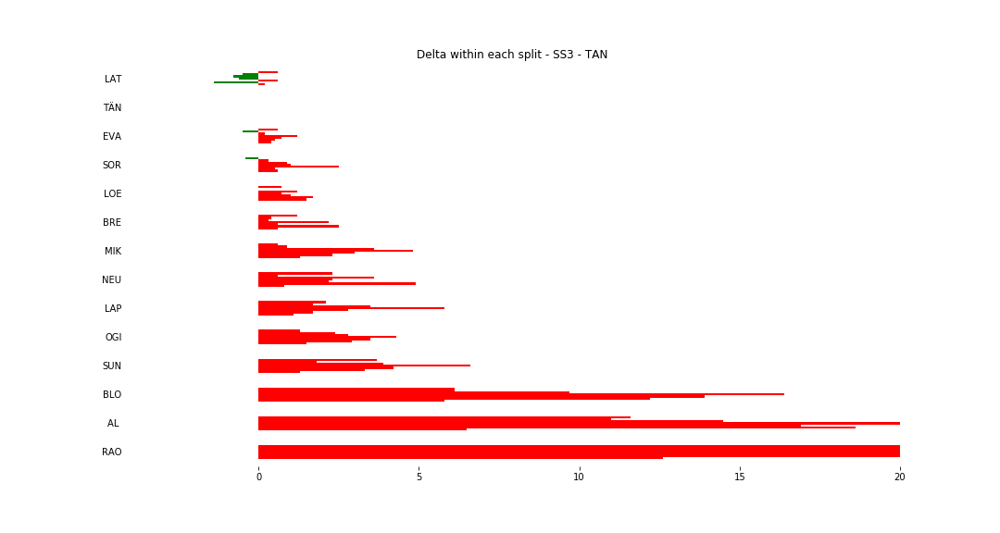
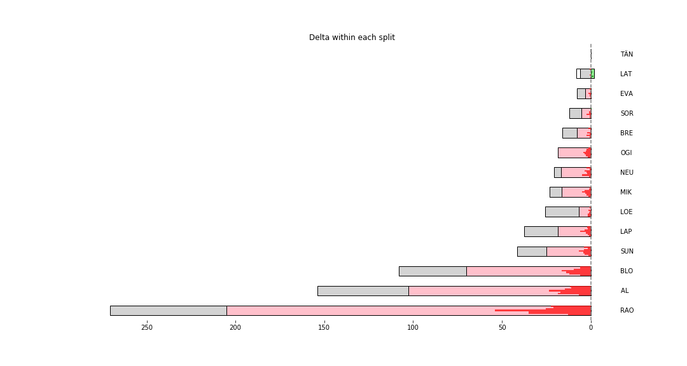

# Stage Map - Spain, 2018 - SS3

# Stage Overall Split Delta Chart - Spain, 2018 - TÄN - SS3

# Stage Within Split Delta Chart - Spain, 2018 - TÄN - SS3

# Stage Progress Chart - Spain, 2018 - TÄN - SS3

|Driver|            Team             |Elapsed Duration|Position|Class Rank|   diffFirst    |    diffPrev    |
|------|-----------------------------|----------------|-------:|---------:|----------------|----------------|
|LAT   |TOYOTA GAZOO RACING WRT      |00:14:36.5000000|       1|         1|00:00:00        |00:00:00        |
|TÄN   |TOYOTA GAZOO RACING WRT      |00:14:38.4000000|       2|         2|00:00:01.9000000|00:00:01.9000000|
|EVA   |M-SPORT FORD WORLD RALLY TEAM|00:14:41.5000000|       3|         3|00:00:05        |00:00:03.1000000|
|SOR   |HYUNDAI SHELL MOBIS WRT      |00:14:43.8000000|       4|         4|00:00:07.3000000|00:00:02.3000000|
|LOE   |CITROËN  TOTAL ABU DHABI WRT |00:14:45.2000000|       5|         5|00:00:08.7000000|00:00:01.4000000|
|BRE   |CITROËN TOTAL ABU DHABI  WRT |00:14:46.1000000|       6|         6|00:00:09.6000000|00:00:00.9000000|
|MIK   |HYUNDAI SHELL MOBIS WRT      |00:14:54.9000000|       7|         7|00:00:18.4000000|00:00:08.8000000|
|NEU   |HYUNDAI SHELL MOBIS WRT      |00:14:55        |       8|         8|00:00:18.5000000|00:00:00.1000000|
|LAP   |TOYOTA GAZOO RACING WRT      |00:14:57        |       9|         9|00:00:20.5000000|00:00:02        |
|OGI   |M-SPORT FORD WORLD RALLY TEAM|00:14:57.1000000|      10|        10|00:00:20.6000000|00:00:00.1000000|
|SUN   |M-SPORT FORD WORLD RALLY TEAM|00:15:03.3000000|      11|        11|00:00:26.8000000|00:00:06.2000000|
|BLO   |HOONIGAN RACING              |00:15:48.6000000|      26|        12|00:01:12.1000000|00:00:03.5000000|
|AL    |CITROËN TOTAL ABU DHABI  WRT |00:16:20.9000000|      30|        13|00:01:44.4000000|00:00:06.6000000|
|RAO   |JEAN-MICHEL RAOUX            |00:18:03.5000000|      41|        14|00:03:27        |00:00:02.1000000|

