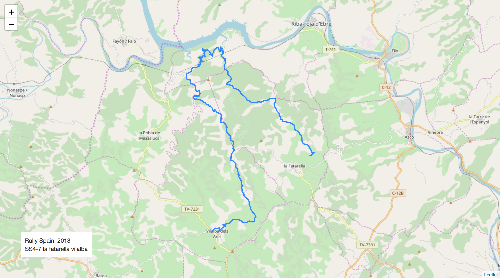
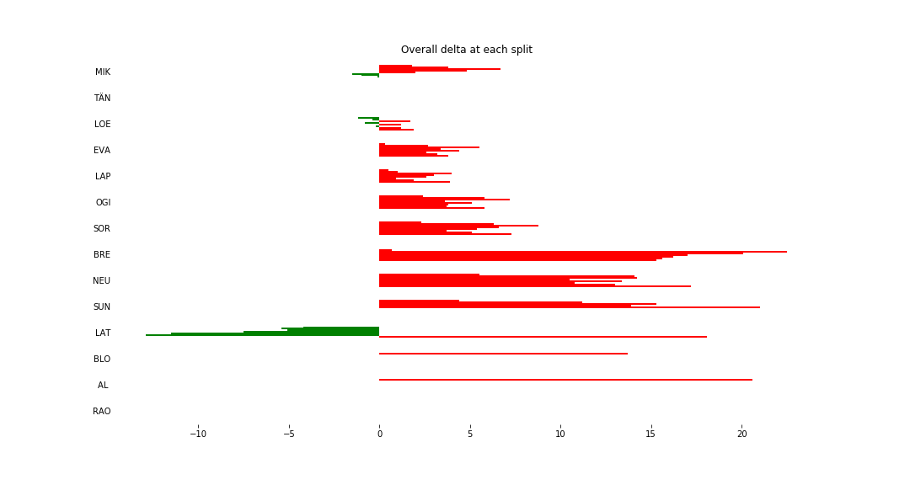
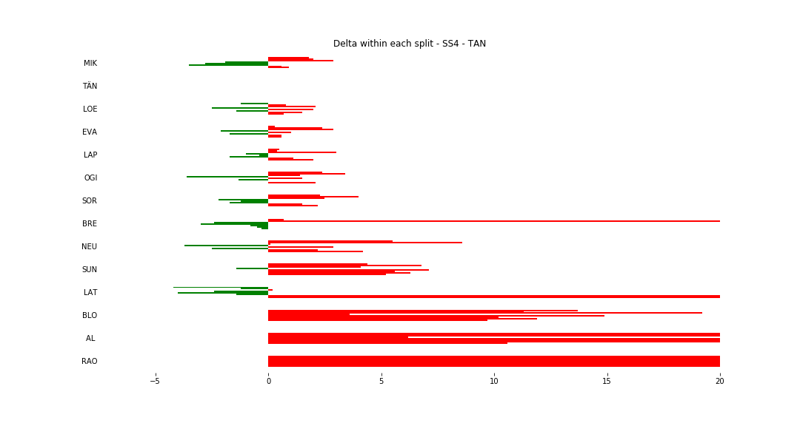
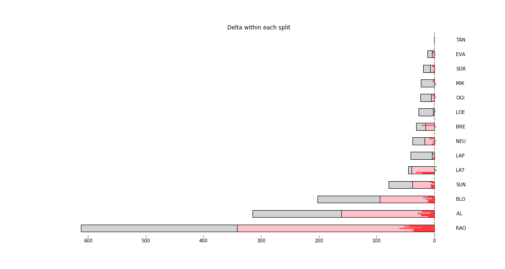

# Stage Map - Spain, 2018 - SS4

# Stage Overall Split Delta Chart - Spain, 2018 - TÄN - SS4

# Stage Within Split Delta Chart - Spain, 2018 - TÄN - SS4

# Stage Progress Chart - Spain, 2018 - TÄN - SS4

|Driver|            Team             |Elapsed Duration|Position|Class Rank|   diffFirst    |    diffPrev    |
|------|-----------------------------|----------------|-------:|---------:|----------------|----------------|
|MIK   |HYUNDAI SHELL MOBIS WRT      |00:27:01.2000000|       1|         1|00:00:00        |00:00:00        |
|TÄN   |TOYOTA GAZOO RACING WRT      |00:27:01.3000000|       2|         2|00:00:00.1000000|00:00:00.1000000|
|LOE   |CITROËN  TOTAL ABU DHABI WRT |00:27:03.2000000|       3|         3|00:00:02        |00:00:01.9000000|
|EVA   |M-SPORT FORD WORLD RALLY TEAM|00:27:05.1000000|       4|         4|00:00:03.9000000|00:00:01.9000000|
|LAP   |TOYOTA GAZOO RACING WRT      |00:27:05.2000000|       5|         5|00:00:04        |00:00:00.1000000|
|OGI   |M-SPORT FORD WORLD RALLY TEAM|00:27:07.1000000|       6|         6|00:00:05.9000000|00:00:01.9000000|
|SOR   |HYUNDAI SHELL MOBIS WRT      |00:27:08.6000000|       7|         7|00:00:07.4000000|00:00:01.5000000|
|BRE   |CITROËN TOTAL ABU DHABI  WRT |00:27:16.6000000|       8|         8|00:00:15.4000000|00:00:08        |
|NEU   |HYUNDAI SHELL MOBIS WRT      |00:27:18.5000000|       9|         9|00:00:17.3000000|00:00:01.9000000|
|SUN   |M-SPORT FORD WORLD RALLY TEAM|00:27:39.3000000|      10|        10|00:00:38.1000000|00:00:20.8000000|
|LAT   |TOYOTA GAZOO RACING WRT      |00:27:40.5000000|      11|        11|00:00:39.3000000|00:00:01.2000000|
|BLO   |HOONIGAN RACING              |00:28:35.7000000|      24|        12|00:01:34.5000000|00:00:15.9000000|
|AL    |CITROËN TOTAL ABU DHABI  WRT |00:29:42.7000000|      26|        13|00:02:41.5000000|00:00:21.8000000|
|RAO   |JEAN-MICHEL RAOUX            |00:32:43        |      47|        14|00:05:41.8000000|00:00:13.8000000|

