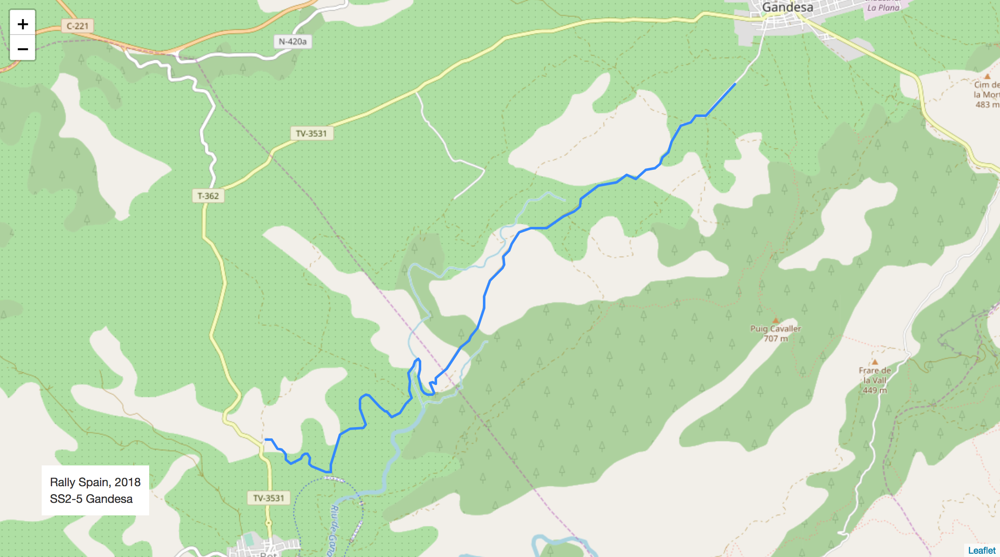
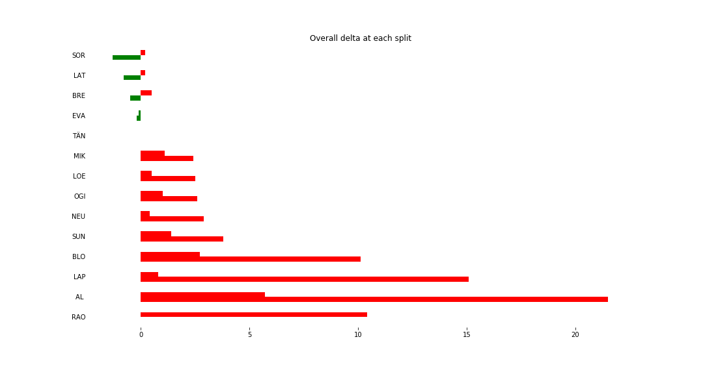
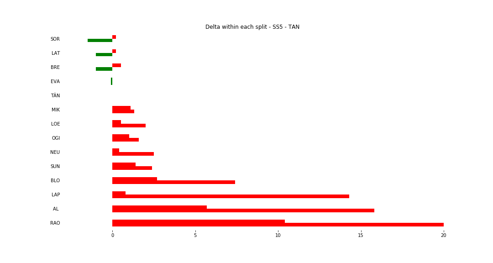
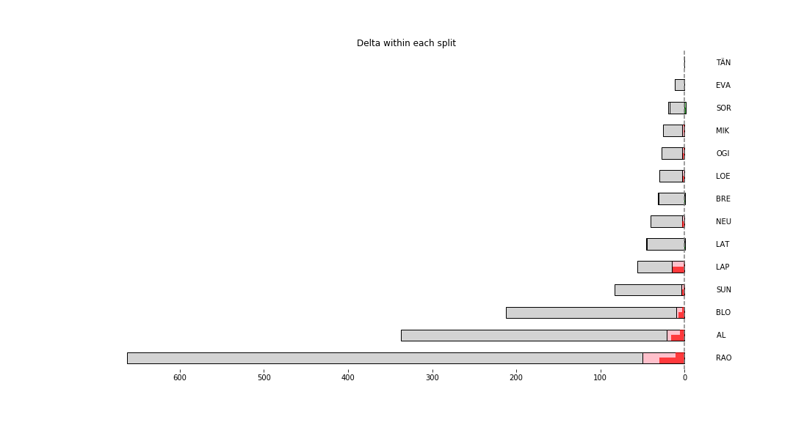

# Stage Map - Spain, 2018 - SS5

# Stage Overall Split Delta Chart - Spain, 2018 - TÄN - SS5

# Stage Within Split Delta Chart - Spain, 2018 - TÄN - SS5

# Stage Progress Chart - Spain, 2018 - TÄN - SS5

|Driver|            Team             |Elapsed Duration|Position|Class Rank|   diffFirst    |    diffPrev    |
|------|-----------------------------|----------------|-------:|---------:|----------------|----------------|
|SOR   |HYUNDAI SHELL MOBIS WRT      |00:04:14.7000000|       1|         1|00:00:00        |00:00:00        |
|LAT   |TOYOTA GAZOO RACING WRT      |00:04:15.2000000|       2|         2|00:00:00.5000000|00:00:00.5000000|
|BRE   |CITROËN TOTAL ABU DHABI  WRT |00:04:15.5000000|       3|         3|00:00:00.8000000|00:00:00.3000000|
|EVA   |M-SPORT FORD WORLD RALLY TEAM|00:04:15.8000000|       4|         4|00:00:01.1000000|00:00:00.3000000|
|TÄN   |TOYOTA GAZOO RACING WRT      |00:04:16        |       5|         5|00:00:01.3000000|00:00:00.2000000|
|MIK   |HYUNDAI SHELL MOBIS WRT      |00:04:18.4000000|       6|         6|00:00:03.7000000|00:00:02.4000000|
|LOE   |CITROËN  TOTAL ABU DHABI WRT |00:04:18.5000000|       7|         7|00:00:03.8000000|00:00:00.1000000|
|OGI   |M-SPORT FORD WORLD RALLY TEAM|00:04:18.6000000|       8|         8|00:00:03.9000000|00:00:00.1000000|
|NEU   |HYUNDAI SHELL MOBIS WRT      |00:04:18.9000000|       9|         9|00:00:04.2000000|00:00:00.3000000|
|SUN   |M-SPORT FORD WORLD RALLY TEAM|00:04:19.8000000|      10|        10|00:00:05.1000000|00:00:00.9000000|
|BLO   |HOONIGAN RACING              |00:04:26.1000000|      13|        11|00:00:11.4000000|00:00:00.1000000|
|LAP   |TOYOTA GAZOO RACING WRT      |00:04:31.1000000|      24|        12|00:00:16.4000000|00:00:00.8000000|
|AL    |CITROËN TOTAL ABU DHABI  WRT |00:04:37.5000000|      29|        13|00:00:22.8000000|00:00:01.2000000|
|RAO   |JEAN-MICHEL RAOUX            |00:04:56.3000000|      32|        14|00:00:41.6000000|00:00:00.1000000|

