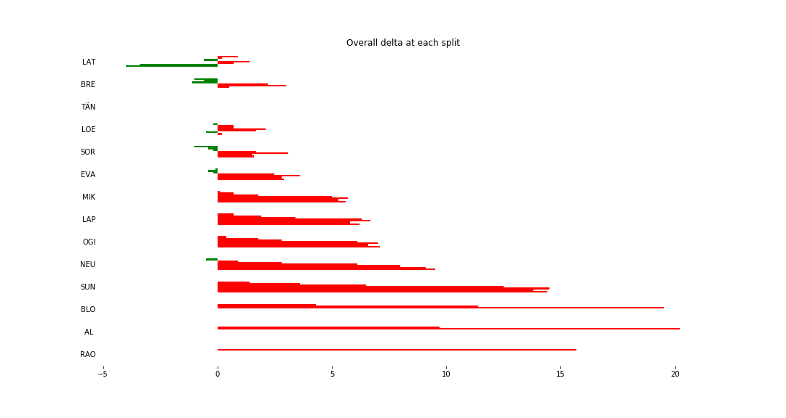
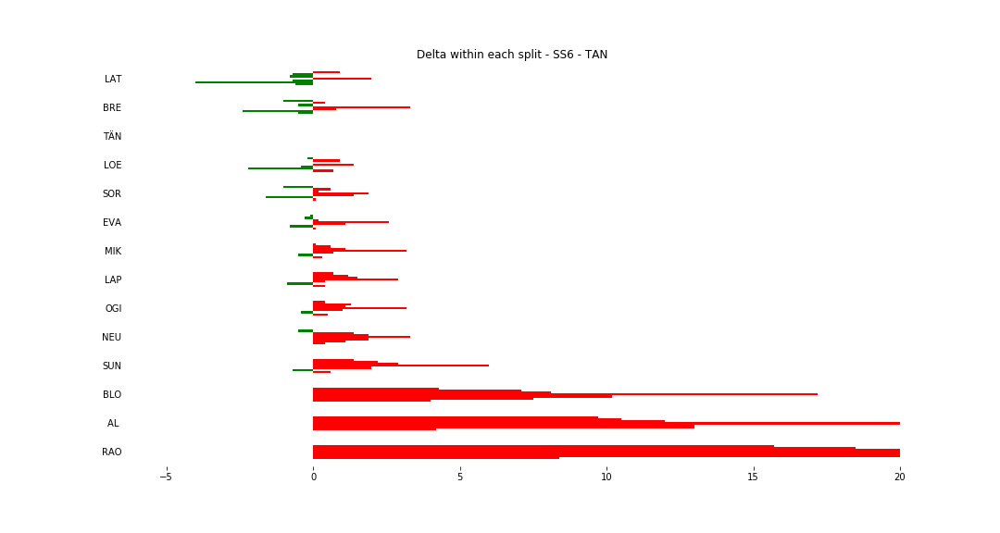
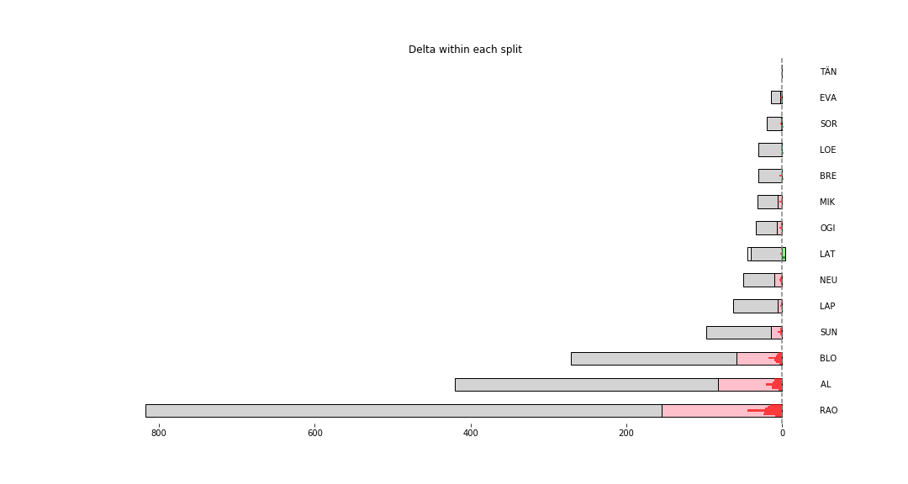

# Stage Map - Spain, 2018 - SS6

# Stage Overall Split Delta Chart - Spain, 2018 - TÄN - SS6

# Stage Within Split Delta Chart - Spain, 2018 - TÄN - SS6

# Stage Progress Chart - Spain, 2018 - TÄN - SS6

|Driver|            Team             |Elapsed Duration|Position|Class Rank|   diffFirst    |    diffPrev    |
|------|-----------------------------|----------------|-------:|---------:|----------------|----------------|
|LAT   |TOYOTA GAZOO RACING WRT      |00:14:12.5000000|       1|         1|00:00:00        |00:00:00        |
|TÄN   |TOYOTA GAZOO RACING WRT      |00:14:16.5000000|       2|         2|00:00:04        |00:00:04        |
|BRE   |CITROËN TOTAL ABU DHABI  WRT |00:14:16.5000000|       3|         3|00:00:04        |00:00:00        |
|LOE   |CITROËN  TOTAL ABU DHABI WRT |00:14:16.7000000|       4|         4|00:00:04.2000000|00:00:00.2000000|
|SOR   |HYUNDAI SHELL MOBIS WRT      |00:14:18.1000000|       5|         5|00:00:05.6000000|00:00:01.4000000|
|EVA   |M-SPORT FORD WORLD RALLY TEAM|00:14:19.4000000|       6|         6|00:00:06.9000000|00:00:01.3000000|
|MIK   |HYUNDAI SHELL MOBIS WRT      |00:14:22.1000000|       7|         7|00:00:09.6000000|00:00:02.7000000|
|LAP   |TOYOTA GAZOO RACING WRT      |00:14:22.7000000|       8|         8|00:00:10.2000000|00:00:00.6000000|
|OGI   |M-SPORT FORD WORLD RALLY TEAM|00:14:23.6000000|       9|         9|00:00:11.1000000|00:00:00.9000000|
|NEU   |HYUNDAI SHELL MOBIS WRT      |00:14:26        |      10|        10|00:00:13.5000000|00:00:02.4000000|
|SUN   |M-SPORT FORD WORLD RALLY TEAM|00:14:30.9000000|      11|        11|00:00:18.4000000|00:00:04.9000000|
|BLO   |HOONIGAN RACING              |00:15:15        |      24|        12|00:01:02.5000000|00:00:02.5000000|
|AL    |CITROËN TOTAL ABU DHABI  WRT |00:15:39.3000000|      25|        13|00:01:26.8000000|00:00:24.3000000|
|RAO   |JEAN-MICHEL RAOUX            |00:16:51.1000000|      31|        14|00:02:38.6000000|00:00:01.2000000|

