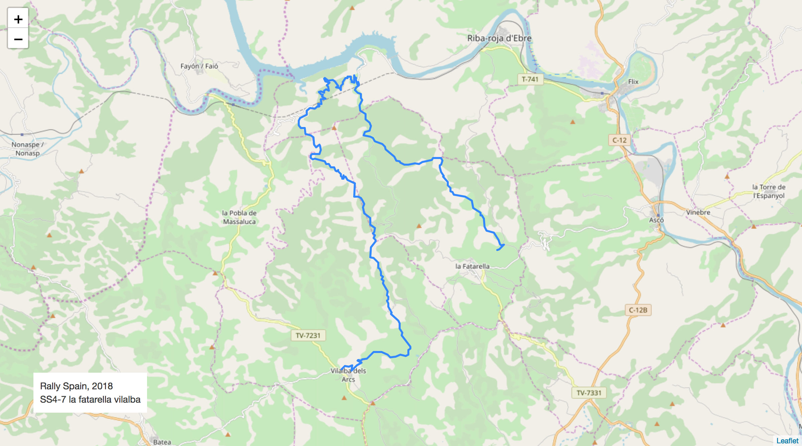

# Stage Map - Spain, 2018 - SS7

# Stage Overall Split Delta Chart - Spain, 2018 - TÄN - SS7

# Stage Within Split Delta Chart - Spain, 2018 - TÄN - SS7

# Stage Progress Chart - Spain, 2018 - TÄN - SS7

|Driver|            Team             |Elapsed Duration|Position|Class Rank|   diffFirst    |    diffPrev    |
|------|-----------------------------|----------------|-------:|---------:|----------------|----------------|
|LAT   |TOYOTA GAZOO RACING WRT      |00:26:13.2000000|       1|         1|00:00:00        |00:00:00        |
|LOE   |CITROËN  TOTAL ABU DHABI WRT |00:26:16.1000000|       2|         2|00:00:02.9000000|00:00:02.9000000|
|TÄN   |TOYOTA GAZOO RACING WRT      |00:26:16.1000000|       3|         3|00:00:02.9000000|00:00:00        |
|LAP   |TOYOTA GAZOO RACING WRT      |00:26:21        |       4|         4|00:00:07.8000000|00:00:04.9000000|
|OGI   |M-SPORT FORD WORLD RALLY TEAM|00:26:21.4000000|       5|         5|00:00:08.2000000|00:00:00.4000000|
|SOR   |HYUNDAI SHELL MOBIS WRT      |00:26:23.4000000|       6|         6|00:00:10.2000000|00:00:02        |
|MIK   |HYUNDAI SHELL MOBIS WRT      |00:26:24        |       7|         7|00:00:10.8000000|00:00:00.6000000|
|NEU   |HYUNDAI SHELL MOBIS WRT      |00:26:25.6000000|       8|         8|00:00:12.4000000|00:00:01.6000000|
|BRE   |CITROËN TOTAL ABU DHABI  WRT |00:26:29.9000000|       9|         9|00:00:16.7000000|00:00:04.3000000|
|EVA   |M-SPORT FORD WORLD RALLY TEAM|00:26:31.4000000|      10|        10|00:00:18.2000000|00:00:01.5000000|
|SUN   |M-SPORT FORD WORLD RALLY TEAM|00:27:03.5000000|      11|        11|00:00:50.3000000|00:00:32.1000000|
|AL    |CITROËN TOTAL ABU DHABI  WRT |00:28:43.2000000|      22|        12|00:02:30        |00:00:40.5000000|
|RAO   |JEAN-MICHEL RAOUX            |00:31:05.1000000|      25|        13|00:04:51.9000000|00:02:14        |
|BLO   |HOONIGAN RACING              |00:36:13.2000000|      51|        14|00:10:00        |00:00:20.5000000|

