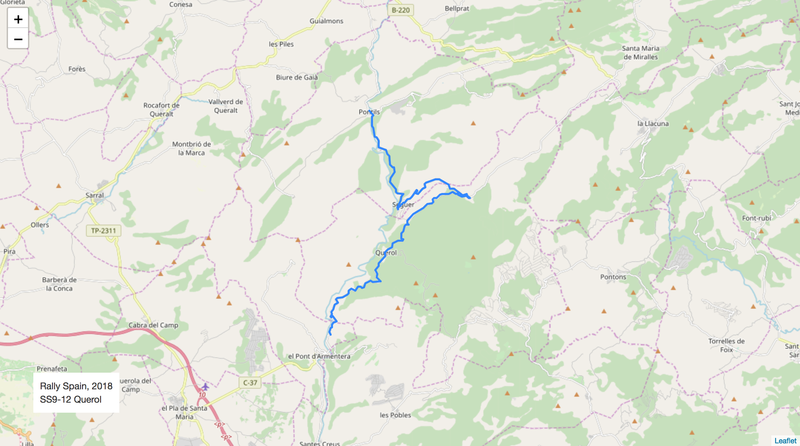
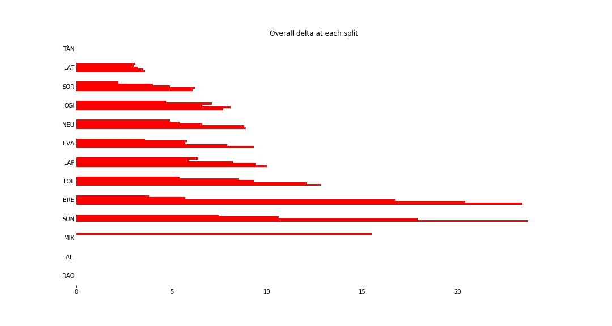
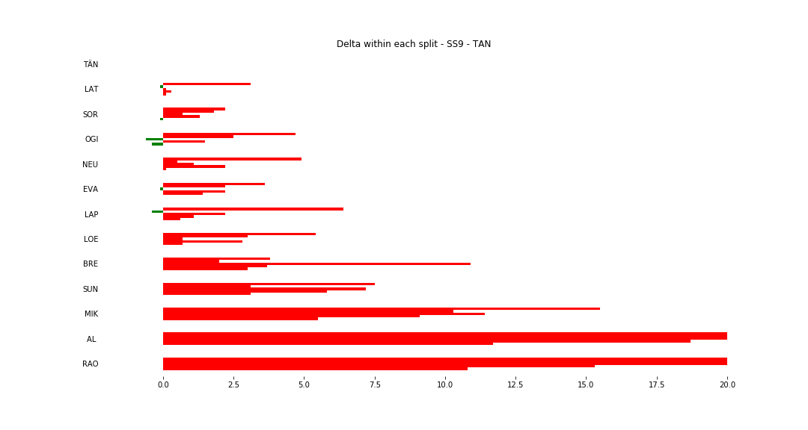
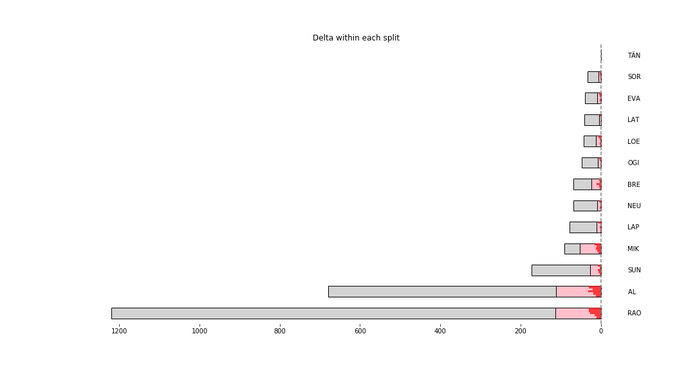

# Stage Map - Spain, 2018 - SS9

# Stage Overall Split Delta Chart - Spain, 2018 - TÄN - SS9

# Stage Within Split Delta Chart - Spain, 2018 - TÄN - SS9

# Stage Progress Chart - Spain, 2018 - TÄN - SS9

|Driver|            Team             |Elapsed Duration|Position|Class Rank|   diffFirst    |    diffPrev    |
|------|-----------------------------|----------------|-------:|---------:|----------------|----------------|
|TÄN   |TOYOTA GAZOO RACING WRT      |00:11:30.6000000|       1|         1|00:00:00        |00:00:00        |
|LAT   |TOYOTA GAZOO RACING WRT      |00:11:34.2000000|       2|         2|00:00:03.6000000|00:00:03.6000000|
|SOR   |HYUNDAI SHELL MOBIS WRT      |00:11:36.7000000|       3|         3|00:00:06.1000000|00:00:02.5000000|
|OGI   |M-SPORT FORD WORLD RALLY TEAM|00:11:38.3000000|       4|         4|00:00:07.7000000|00:00:01.6000000|
|NEU   |HYUNDAI SHELL MOBIS WRT      |00:11:39.5000000|       5|         5|00:00:08.9000000|00:00:01.2000000|
|EVA   |M-SPORT FORD WORLD RALLY TEAM|00:11:39.9000000|       6|         6|00:00:09.3000000|00:00:00.4000000|
|LAP   |TOYOTA GAZOO RACING WRT      |00:11:40.6000000|       7|         7|00:00:10        |00:00:00.7000000|
|LOE   |CITROËN  TOTAL ABU DHABI WRT |00:11:43.4000000|       8|         8|00:00:12.8000000|00:00:02.8000000|
|BRE   |CITROËN TOTAL ABU DHABI  WRT |00:11:54        |       9|         9|00:00:23.4000000|00:00:10.6000000|
|SUN   |M-SPORT FORD WORLD RALLY TEAM|00:11:57.4000000|      10|        10|00:00:26.8000000|00:00:03.4000000|
|MIK   |HYUNDAI SHELL MOBIS WRT      |00:12:22.5000000|      15|        11|00:00:51.9000000|00:00:00.7000000|
|AL    |CITROËN TOTAL ABU DHABI  WRT |00:13:22.7000000|      30|        12|00:01:52.1000000|00:00:23.8000000|
|RAO   |JEAN-MICHEL RAOUX            |00:13:24.1000000|      31|        13|00:01:53.5000000|00:00:01.4000000|

