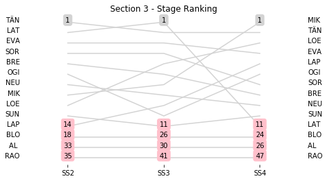
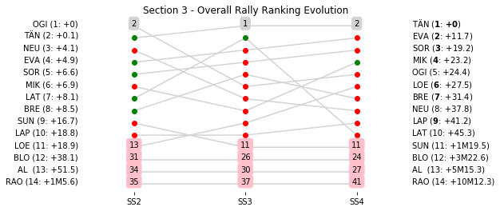

# Section 3, Friday 26th October

This section comprises three special stages (SS2 - Gandesa 1 (gravel) (7.0km), SS3 - Pesells 1 (gravel) (26.59km), SS4 - La Fatarella -Vilalba 1 (gravel & asphalt) (38.85km))

The full scheduled itinerary for the section was as follows:

	- 08:00:00 TC1B Parc Fermé OUT - Service IN  [None]
	- 08:15:00 TC1C Service OUT  [00:15:00]
	- 09:30:00 TC2 Gandesa (79.93km) [01:15:00]
	- 09:33:00 SS2 Gandesa 1 (gravel) (7.0km) [00:03:00]
	- 10:03:00 TC3 Pesells (10.07km) [00:30:00]
	- 10:06:00 SS3 Pesells 1 (gravel) (26.59km) [00:03:00]
	- 11:17:00 TC4 La Fatarella (32.48km) [01:11:00]
	- 11:20:00 SS4 La Fatarella -Vilalba 1 (gravel & asphalt) (38.85km) [00:03:00]
	- 13:15:00 TC4A Regroup and Technical Zone  IN (85.37km) [01:55:00]

### Section 3 Report
Section 3

Section 3

##Stage Result - SS2

|Driver|            Team             |Elapsed Duration|Position|Class Rank|   diffFirst    |    diffPrev    |
|------|-----------------------------|----------------|-------:|---------:|----------------|----------------|
|TÄN   |TOYOTA GAZOO RACING WRT      |00:04:19.6000000|       1|         1|00:00:00        |00:00:00        |
|LAT   |TOYOTA GAZOO RACING WRT      |00:04:22.1000000|       2|         2|00:00:02.5000000|00:00:02.5000000|
|EVA   |M-SPORT FORD WORLD RALLY TEAM|00:04:22.6000000|       3|         3|00:00:03        |00:00:00.5000000|
|SOR   |HYUNDAI SHELL MOBIS WRT      |00:04:22.8000000|       4|         4|00:00:03.2000000|00:00:00.2000000|
|BRE   |CITROËN TOTAL ABU DHABI  WRT |00:04:23.5000000|       5|         5|00:00:03.9000000|00:00:00.7000000|
|OGI   |M-SPORT FORD WORLD RALLY TEAM|00:04:23.7000000|       6|         6|00:00:04.1000000|00:00:00.2000000|
|NEU   |HYUNDAI SHELL MOBIS WRT      |00:04:24.1000000|       7|         7|00:00:04.5000000|00:00:00.4000000|
|MIK   |HYUNDAI SHELL MOBIS WRT      |00:04:25        |       8|         8|00:00:05.4000000|00:00:00.9000000|
|LOE   |CITROËN  TOTAL ABU DHABI WRT |00:04:26.7000000|       9|         9|00:00:07.1000000|00:00:01.7000000|
|SUN   |M-SPORT FORD WORLD RALLY TEAM|00:04:29.5000000|      10|        10|00:00:09.9000000|00:00:02.8000000|
|LAP   |TOYOTA GAZOO RACING WRT      |00:04:32.7000000|      14|        11|00:00:13.1000000|00:00:01        |
|BLO   |HOONIGAN RACING              |00:04:35.3000000|      18|        12|00:00:15.7000000|00:00:00.2000000|
|AL    |CITROËN TOTAL ABU DHABI  WRT |00:04:48.5000000|      33|        13|00:00:28.9000000|00:00:00.1000000|
|RAO   |JEAN-MICHEL RAOUX            |00:05:00        |      35|        14|00:00:40.4000000|00:00:09.5000000|

##Stage Result - SS3

|Driver|            Team             |Elapsed Duration|Position|Class Rank|   diffFirst    |    diffPrev    |
|------|-----------------------------|----------------|-------:|---------:|----------------|----------------|
|LAT   |TOYOTA GAZOO RACING WRT      |00:14:36.5000000|       1|         1|00:00:00        |00:00:00        |
|TÄN   |TOYOTA GAZOO RACING WRT      |00:14:38.4000000|       2|         2|00:00:01.9000000|00:00:01.9000000|
|EVA   |M-SPORT FORD WORLD RALLY TEAM|00:14:41.5000000|       3|         3|00:00:05        |00:00:03.1000000|
|SOR   |HYUNDAI SHELL MOBIS WRT      |00:14:43.8000000|       4|         4|00:00:07.3000000|00:00:02.3000000|
|LOE   |CITROËN  TOTAL ABU DHABI WRT |00:14:45.2000000|       5|         5|00:00:08.7000000|00:00:01.4000000|
|BRE   |CITROËN TOTAL ABU DHABI  WRT |00:14:46.1000000|       6|         6|00:00:09.6000000|00:00:00.9000000|
|MIK   |HYUNDAI SHELL MOBIS WRT      |00:14:54.9000000|       7|         7|00:00:18.4000000|00:00:08.8000000|
|NEU   |HYUNDAI SHELL MOBIS WRT      |00:14:55        |       8|         8|00:00:18.5000000|00:00:00.1000000|
|LAP   |TOYOTA GAZOO RACING WRT      |00:14:57        |       9|         9|00:00:20.5000000|00:00:02        |
|OGI   |M-SPORT FORD WORLD RALLY TEAM|00:14:57.1000000|      10|        10|00:00:20.6000000|00:00:00.1000000|
|SUN   |M-SPORT FORD WORLD RALLY TEAM|00:15:03.3000000|      11|        11|00:00:26.8000000|00:00:06.2000000|
|BLO   |HOONIGAN RACING              |00:15:48.6000000|      26|        12|00:01:12.1000000|00:00:03.5000000|
|AL    |CITROËN TOTAL ABU DHABI  WRT |00:16:20.9000000|      30|        13|00:01:44.4000000|00:00:06.6000000|
|RAO   |JEAN-MICHEL RAOUX            |00:18:03.5000000|      41|        14|00:03:27        |00:00:02.1000000|

##Stage Result - SS4

|Driver|            Team             |Elapsed Duration|Position|Class Rank|   diffFirst    |    diffPrev    |
|------|-----------------------------|----------------|-------:|---------:|----------------|----------------|
|MIK   |HYUNDAI SHELL MOBIS WRT      |00:27:01.2000000|       1|         1|00:00:00        |00:00:00        |
|TÄN   |TOYOTA GAZOO RACING WRT      |00:27:01.3000000|       2|         2|00:00:00.1000000|00:00:00.1000000|
|LOE   |CITROËN  TOTAL ABU DHABI WRT |00:27:03.2000000|       3|         3|00:00:02        |00:00:01.9000000|
|EVA   |M-SPORT FORD WORLD RALLY TEAM|00:27:05.1000000|       4|         4|00:00:03.9000000|00:00:01.9000000|
|LAP   |TOYOTA GAZOO RACING WRT      |00:27:05.2000000|       5|         5|00:00:04        |00:00:00.1000000|
|OGI   |M-SPORT FORD WORLD RALLY TEAM|00:27:07.1000000|       6|         6|00:00:05.9000000|00:00:01.9000000|
|SOR   |HYUNDAI SHELL MOBIS WRT      |00:27:08.6000000|       7|         7|00:00:07.4000000|00:00:01.5000000|
|BRE   |CITROËN TOTAL ABU DHABI  WRT |00:27:16.6000000|       8|         8|00:00:15.4000000|00:00:08        |
|NEU   |HYUNDAI SHELL MOBIS WRT      |00:27:18.5000000|       9|         9|00:00:17.3000000|00:00:01.9000000|
|SUN   |M-SPORT FORD WORLD RALLY TEAM|00:27:39.3000000|      10|        10|00:00:38.1000000|00:00:20.8000000|
|LAT   |TOYOTA GAZOO RACING WRT      |00:27:40.5000000|      11|        11|00:00:39.3000000|00:00:01.2000000|
|BLO   |HOONIGAN RACING              |00:28:35.7000000|      24|        12|00:01:34.5000000|00:00:15.9000000|
|AL    |CITROËN TOTAL ABU DHABI  WRT |00:29:42.7000000|      26|        13|00:02:41.5000000|00:00:21.8000000|
|RAO   |JEAN-MICHEL RAOUX            |00:32:43        |      47|        14|00:05:41.8000000|00:00:13.8000000|

