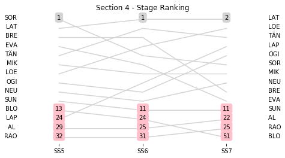
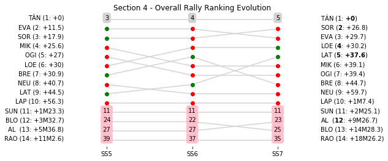

# Section 4, Friday 26th October

This section comprises three special stages (SS5 - Gandesa 2 (gravel) (7.0km), SS6 - Pesells 2 (gravel) (26.59km), SS7 - La Fatarella -Vilalba 2 (gravel & asphalt) (38.85km))

The full scheduled itinerary for the section was as follows:

	- 13:35:00 TC4B Regroup OUT - Service IN  [00:20:00]
	- 14:05:00 TC4C Service OUT  [00:30:00]
	- 15:20:00 TC5 Gandesa (79.93km) [01:15:00]
	- 15:23:00 SS5 Gandesa 2 (gravel) (7.0km) [00:03:00]
	- 15:53:00 TC6 Pesells (10.07km) [00:30:00]
	- 15:56:00 SS6 Pesells 2 (gravel) (26.59km) [00:03:00]
	- 17:07:00 TC7 La Fatarella (32.48km) [01:11:00]
	- 17:10:00 SS7 La Fatarella -Vilalba 2 (gravel & asphalt) (38.85km) [00:03:00]
	- 19:10:00 TC7A Parc Fermé and Technical Zone  IN (87.19km) [02:00:00]
	- 19:20:00 TC7B Parc Fermé OUT / FlexiService IN  [00:10:00]
	- 20:35:00 TC7C Flexiservice OUT / Parc Fermé IN (PortAventura)  [01:15:00]

### Section 4 Report
Section 4

Section 4

##Stage Result - SS5

|Driver|            Team             |Elapsed Duration|Position|Class Rank|   diffFirst    |    diffPrev    |
|------|-----------------------------|----------------|-------:|---------:|----------------|----------------|
|SOR   |HYUNDAI SHELL MOBIS WRT      |00:04:14.7000000|       1|         1|00:00:00        |00:00:00        |
|LAT   |TOYOTA GAZOO RACING WRT      |00:04:15.2000000|       2|         2|00:00:00.5000000|00:00:00.5000000|
|BRE   |CITROËN TOTAL ABU DHABI  WRT |00:04:15.5000000|       3|         3|00:00:00.8000000|00:00:00.3000000|
|EVA   |M-SPORT FORD WORLD RALLY TEAM|00:04:15.8000000|       4|         4|00:00:01.1000000|00:00:00.3000000|
|TÄN   |TOYOTA GAZOO RACING WRT      |00:04:16        |       5|         5|00:00:01.3000000|00:00:00.2000000|
|MIK   |HYUNDAI SHELL MOBIS WRT      |00:04:18.4000000|       6|         6|00:00:03.7000000|00:00:02.4000000|
|LOE   |CITROËN  TOTAL ABU DHABI WRT |00:04:18.5000000|       7|         7|00:00:03.8000000|00:00:00.1000000|
|OGI   |M-SPORT FORD WORLD RALLY TEAM|00:04:18.6000000|       8|         8|00:00:03.9000000|00:00:00.1000000|
|NEU   |HYUNDAI SHELL MOBIS WRT      |00:04:18.9000000|       9|         9|00:00:04.2000000|00:00:00.3000000|
|SUN   |M-SPORT FORD WORLD RALLY TEAM|00:04:19.8000000|      10|        10|00:00:05.1000000|00:00:00.9000000|
|BLO   |HOONIGAN RACING              |00:04:26.1000000|      13|        11|00:00:11.4000000|00:00:00.1000000|
|LAP   |TOYOTA GAZOO RACING WRT      |00:04:31.1000000|      24|        12|00:00:16.4000000|00:00:00.8000000|
|AL    |CITROËN TOTAL ABU DHABI  WRT |00:04:37.5000000|      29|        13|00:00:22.8000000|00:00:01.2000000|
|RAO   |JEAN-MICHEL RAOUX            |00:04:56.3000000|      32|        14|00:00:41.6000000|00:00:00.1000000|

##Stage Result - SS6

|Driver|            Team             |Elapsed Duration|Position|Class Rank|   diffFirst    |    diffPrev    |
|------|-----------------------------|----------------|-------:|---------:|----------------|----------------|
|LAT   |TOYOTA GAZOO RACING WRT      |00:14:12.5000000|       1|         1|00:00:00        |00:00:00        |
|TÄN   |TOYOTA GAZOO RACING WRT      |00:14:16.5000000|       2|         2|00:00:04        |00:00:04        |
|BRE   |CITROËN TOTAL ABU DHABI  WRT |00:14:16.5000000|       3|         3|00:00:04        |00:00:00        |
|LOE   |CITROËN  TOTAL ABU DHABI WRT |00:14:16.7000000|       4|         4|00:00:04.2000000|00:00:00.2000000|
|SOR   |HYUNDAI SHELL MOBIS WRT      |00:14:18.1000000|       5|         5|00:00:05.6000000|00:00:01.4000000|
|EVA   |M-SPORT FORD WORLD RALLY TEAM|00:14:19.4000000|       6|         6|00:00:06.9000000|00:00:01.3000000|
|MIK   |HYUNDAI SHELL MOBIS WRT      |00:14:22.1000000|       7|         7|00:00:09.6000000|00:00:02.7000000|
|LAP   |TOYOTA GAZOO RACING WRT      |00:14:22.7000000|       8|         8|00:00:10.2000000|00:00:00.6000000|
|OGI   |M-SPORT FORD WORLD RALLY TEAM|00:14:23.6000000|       9|         9|00:00:11.1000000|00:00:00.9000000|
|NEU   |HYUNDAI SHELL MOBIS WRT      |00:14:26        |      10|        10|00:00:13.5000000|00:00:02.4000000|
|SUN   |M-SPORT FORD WORLD RALLY TEAM|00:14:30.9000000|      11|        11|00:00:18.4000000|00:00:04.9000000|
|BLO   |HOONIGAN RACING              |00:15:15        |      24|        12|00:01:02.5000000|00:00:02.5000000|
|AL    |CITROËN TOTAL ABU DHABI  WRT |00:15:39.3000000|      25|        13|00:01:26.8000000|00:00:24.3000000|
|RAO   |JEAN-MICHEL RAOUX            |00:16:51.1000000|      31|        14|00:02:38.6000000|00:00:01.2000000|

##Stage Result - SS7

|Driver|            Team             |Elapsed Duration|Position|Class Rank|   diffFirst    |    diffPrev    |
|------|-----------------------------|----------------|-------:|---------:|----------------|----------------|
|LAT   |TOYOTA GAZOO RACING WRT      |00:26:13.2000000|       1|         1|00:00:00        |00:00:00        |
|LOE   |CITROËN  TOTAL ABU DHABI WRT |00:26:16.1000000|       2|         2|00:00:02.9000000|00:00:02.9000000|
|TÄN   |TOYOTA GAZOO RACING WRT      |00:26:16.1000000|       3|         3|00:00:02.9000000|00:00:00        |
|LAP   |TOYOTA GAZOO RACING WRT      |00:26:21        |       4|         4|00:00:07.8000000|00:00:04.9000000|
|OGI   |M-SPORT FORD WORLD RALLY TEAM|00:26:21.4000000|       5|         5|00:00:08.2000000|00:00:00.4000000|
|SOR   |HYUNDAI SHELL MOBIS WRT      |00:26:23.4000000|       6|         6|00:00:10.2000000|00:00:02        |
|MIK   |HYUNDAI SHELL MOBIS WRT      |00:26:24        |       7|         7|00:00:10.8000000|00:00:00.6000000|
|NEU   |HYUNDAI SHELL MOBIS WRT      |00:26:25.6000000|       8|         8|00:00:12.4000000|00:00:01.6000000|
|BRE   |CITROËN TOTAL ABU DHABI  WRT |00:26:29.9000000|       9|         9|00:00:16.7000000|00:00:04.3000000|
|EVA   |M-SPORT FORD WORLD RALLY TEAM|00:26:31.4000000|      10|        10|00:00:18.2000000|00:00:01.5000000|
|SUN   |M-SPORT FORD WORLD RALLY TEAM|00:27:03.5000000|      11|        11|00:00:50.3000000|00:00:32.1000000|
|AL    |CITROËN TOTAL ABU DHABI  WRT |00:28:43.2000000|      22|        12|00:02:30        |00:00:40.5000000|
|RAO   |JEAN-MICHEL RAOUX            |00:31:05.1000000|      25|        13|00:04:51.9000000|00:02:14        |
|BLO   |HOONIGAN RACING              |00:36:13.2000000|      51|        14|00:10:00        |00:00:20.5000000|

