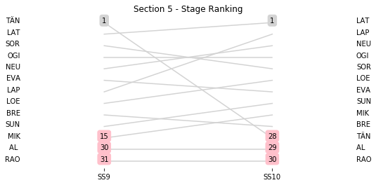
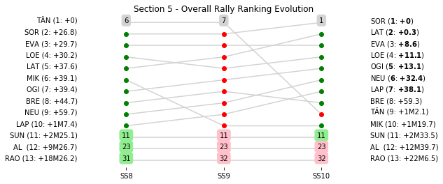

# Section 5, Saturday 27th October

This section comprises three special stages (SS8 - Savallà 1 (asphalt) (14.12km), SS9 - Querol 1 (asphalt) (21.26km), SS10 - El Montmell 1 (asphalt) TV Live (24.4km))

The full scheduled itinerary for the section was as follows:

	- 06:45:00 TC7D Parc Fermé OUT - Service IN  [None]
	- 07:00:00 TC7E Service OUT  [00:15:00]
	- 08:20:00 TC8 Savallà (72.94km) [01:20:00]
	- 08:23:00 SS8 Savallà 1 (asphalt) (14.12km) [00:03:00]
	- 09:05:00 TC9 Querol (15.49km) [00:42:00]
	- 09:08:00 SS9 Querol 1 (asphalt) (21.26km) [00:03:00]
	- 10:01:00 TC10 El Montmell (14.0km) [00:53:00]
	- 10:08:00 SS10 El Montmell 1 (asphalt) TV Live (24.4km) [00:07:00]
	- 11:33:00 TC10A Regroup and Technical Zone IN Port Aventura (66.43km) [01:25:00]

### Section 5 Report
Section 5

Section 5

##Stage Result - SS8

|Driver|Team|Elapsed Duration|Position|Class Rank|diffFirst|diffPrev|
|------|----|----------------|--------|----------|---------|--------|

##Stage Result - SS9

|Driver|            Team             |Elapsed Duration|Position|Class Rank|   diffFirst    |    diffPrev    |
|------|-----------------------------|----------------|-------:|---------:|----------------|----------------|
|TÄN   |TOYOTA GAZOO RACING WRT      |00:11:30.6000000|       1|         1|00:00:00        |00:00:00        |
|LAT   |TOYOTA GAZOO RACING WRT      |00:11:34.2000000|       2|         2|00:00:03.6000000|00:00:03.6000000|
|SOR   |HYUNDAI SHELL MOBIS WRT      |00:11:36.7000000|       3|         3|00:00:06.1000000|00:00:02.5000000|
|OGI   |M-SPORT FORD WORLD RALLY TEAM|00:11:38.3000000|       4|         4|00:00:07.7000000|00:00:01.6000000|
|NEU   |HYUNDAI SHELL MOBIS WRT      |00:11:39.5000000|       5|         5|00:00:08.9000000|00:00:01.2000000|
|EVA   |M-SPORT FORD WORLD RALLY TEAM|00:11:39.9000000|       6|         6|00:00:09.3000000|00:00:00.4000000|
|LAP   |TOYOTA GAZOO RACING WRT      |00:11:40.6000000|       7|         7|00:00:10        |00:00:00.7000000|
|LOE   |CITROËN  TOTAL ABU DHABI WRT |00:11:43.4000000|       8|         8|00:00:12.8000000|00:00:02.8000000|
|BRE   |CITROËN TOTAL ABU DHABI  WRT |00:11:54        |       9|         9|00:00:23.4000000|00:00:10.6000000|
|SUN   |M-SPORT FORD WORLD RALLY TEAM|00:11:57.4000000|      10|        10|00:00:26.8000000|00:00:03.4000000|
|MIK   |HYUNDAI SHELL MOBIS WRT      |00:12:22.5000000|      15|        11|00:00:51.9000000|00:00:00.7000000|
|AL    |CITROËN TOTAL ABU DHABI  WRT |00:13:22.7000000|      30|        12|00:01:52.1000000|00:00:23.8000000|
|RAO   |JEAN-MICHEL RAOUX            |00:13:24.1000000|      31|        13|00:01:53.5000000|00:00:01.4000000|

##Stage Result - SS10

|Driver|            Team             |Elapsed Duration|Position|Class Rank|   diffFirst    |    diffPrev    |
|------|-----------------------------|----------------|-------:|---------:|----------------|----------------|
|LAT   |TOYOTA GAZOO RACING WRT      |00:12:58.4000000|       1|         1|00:00:00        |00:00:00        |
|LAP   |TOYOTA GAZOO RACING WRT      |00:13:00        |       2|         2|00:00:01.6000000|00:00:01.6000000|
|NEU   |HYUNDAI SHELL MOBIS WRT      |00:13:03.1000000|       3|         3|00:00:04.7000000|00:00:03.1000000|
|OGI   |M-SPORT FORD WORLD RALLY TEAM|00:13:05.3000000|       4|         4|00:00:06.9000000|00:00:02.2000000|
|SOR   |HYUNDAI SHELL MOBIS WRT      |00:13:06.4000000|       5|         5|00:00:08        |00:00:01.1000000|
|LOE   |CITROËN  TOTAL ABU DHABI WRT |00:13:07.4000000|       6|         6|00:00:09        |00:00:01        |
|EVA   |M-SPORT FORD WORLD RALLY TEAM|00:13:08.9000000|       7|         7|00:00:10.5000000|00:00:01.5000000|
|SUN   |M-SPORT FORD WORLD RALLY TEAM|00:13:20.9000000|       8|         8|00:00:22.5000000|00:00:12        |
|MIK   |HYUNDAI SHELL MOBIS WRT      |00:13:28        |       9|         9|00:00:29.6000000|00:00:07.1000000|
|BRE   |CITROËN TOTAL ABU DHABI  WRT |00:13:30.5000000|      10|        10|00:00:32.1000000|00:00:02.5000000|
|TÄN   |TOYOTA GAZOO RACING WRT      |00:14:41.4000000|      28|        11|00:01:43        |00:00:14        |
|AL    |CITROËN TOTAL ABU DHABI  WRT |00:15:00.2000000|      29|        12|00:02:01.8000000|00:00:18.8000000|
|RAO   |JEAN-MICHEL RAOUX            |00:15:26.1000000|      30|        13|00:02:27.7000000|00:00:25.9000000|

