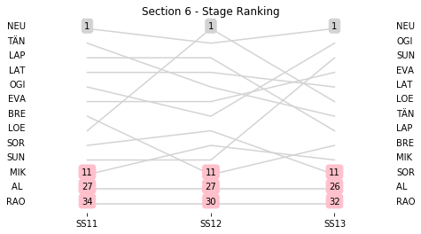
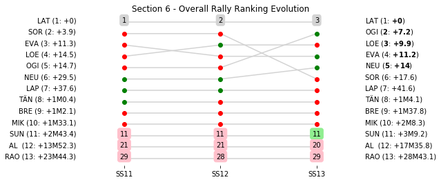

# Section 6, Saturday 27th October

This section comprises three special stages (SS11 - Savallà 2 (asphalt) (14.12km), SS12 - Querol 2 (asphalt) (21.26km), SS13 - El Montmell 2 (asphalt) TV Live (24.4km))

The full scheduled itinerary for the section was as follows:

	- 11:43:00 TC10B Regroup OUT - Service IN  [00:10:00]
	- 12:13:00 TC10C Service OUT  [00:30:00]
	- 13:25:00 TC11 Savallà (72.94km) [01:12:00]
	- 13:28:00 SS11 Savallà 2 (asphalt) (14.12km) [00:03:00]
	- 14:07:00 TC12 Querol (15.49km) [00:39:00]
	- 14:10:00 SS12 Querol 2 (asphalt) (21.26km) [00:03:00]
	- 15:01:00 TC13 El Montmell (14.0km) [00:51:00]
	- 15:08:00 SS13 El Montmell 2 (asphalt) TV Live (24.4km) [00:07:00]
	- 16:42:00 TC13A Regroup IN - Salou (71.33km) [01:34:00]

### Section 6 Report
Section 6

Section 6

##Stage Result - SS11

|Driver|            Team             |Elapsed Duration|Position|Class Rank|   diffFirst    |    diffPrev    |
|------|-----------------------------|----------------|-------:|---------:|----------------|----------------|
|NEU   |HYUNDAI SHELL MOBIS WRT      |00:07:47.1000000|       1|         1|00:00:00        |00:00:00        |
|TÄN   |TOYOTA GAZOO RACING WRT      |00:07:48.3000000|       2|         2|00:00:01.2000000|00:00:01.2000000|
|LAP   |TOYOTA GAZOO RACING WRT      |00:07:49.5000000|       3|         3|00:00:02.4000000|00:00:01.2000000|
|LAT   |TOYOTA GAZOO RACING WRT      |00:07:49.7000000|       4|         4|00:00:02.6000000|00:00:00.2000000|
|OGI   |M-SPORT FORD WORLD RALLY TEAM|00:07:51.6000000|       5|         5|00:00:04.5000000|00:00:01.9000000|
|EVA   |M-SPORT FORD WORLD RALLY TEAM|00:07:52.7000000|       6|         6|00:00:05.6000000|00:00:01.1000000|
|BRE   |CITROËN TOTAL ABU DHABI  WRT |00:07:52.8000000|       7|         7|00:00:05.7000000|00:00:00.1000000|
|LOE   |CITROËN  TOTAL ABU DHABI WRT |00:07:53.4000000|       8|         8|00:00:06.3000000|00:00:00.6000000|
|SOR   |HYUNDAI SHELL MOBIS WRT      |00:07:53.9000000|       9|         9|00:00:06.8000000|00:00:00.5000000|
|SUN   |M-SPORT FORD WORLD RALLY TEAM|00:07:59.9000000|      10|        10|00:00:12.8000000|00:00:06        |
|MIK   |HYUNDAI SHELL MOBIS WRT      |00:08:03.4000000|      11|        11|00:00:16.3000000|00:00:03.5000000|
|AL    |CITROËN TOTAL ABU DHABI  WRT |00:09:02.6000000|      27|        12|00:01:15.5000000|00:00:27.8000000|
|RAO   |JEAN-MICHEL RAOUX            |00:09:27.8000000|      34|        13|00:01:40.7000000|00:00:00.9000000|

##Stage Result - SS12

|Driver|            Team             |Elapsed Duration|Position|Class Rank|   diffFirst    |    diffPrev    |
|------|-----------------------------|----------------|-------:|---------:|----------------|----------------|
|LOE   |CITROËN  TOTAL ABU DHABI WRT |00:11:25.8000000|       1|         1|00:00:00        |00:00:00        |
|NEU   |HYUNDAI SHELL MOBIS WRT      |00:11:26.4000000|       2|         2|00:00:00.6000000|00:00:00.6000000|
|LAP   |TOYOTA GAZOO RACING WRT      |00:11:31.1000000|       3|         3|00:00:05.3000000|00:00:04.7000000|
|LAT   |TOYOTA GAZOO RACING WRT      |00:11:32.8000000|       4|         4|00:00:07        |00:00:01.7000000|
|TÄN   |TOYOTA GAZOO RACING WRT      |00:11:33.2000000|       5|         5|00:00:07.4000000|00:00:00.4000000|
|EVA   |M-SPORT FORD WORLD RALLY TEAM|00:11:33.3000000|       6|         6|00:00:07.5000000|00:00:00.1000000|
|OGI   |M-SPORT FORD WORLD RALLY TEAM|00:11:33.5000000|       7|         7|00:00:07.7000000|00:00:00.2000000|
|SOR   |HYUNDAI SHELL MOBIS WRT      |00:11:33.6000000|       8|         8|00:00:07.8000000|00:00:00.1000000|
|MIK   |HYUNDAI SHELL MOBIS WRT      |00:11:55.8000000|       9|         9|00:00:30        |00:00:22.2000000|
|SUN   |M-SPORT FORD WORLD RALLY TEAM|00:12:01.1000000|      10|        10|00:00:35.3000000|00:00:05.3000000|
|BRE   |CITROËN TOTAL ABU DHABI  WRT |00:12:02.3000000|      11|        11|00:00:36.5000000|00:00:01.2000000|
|AL    |CITROËN TOTAL ABU DHABI  WRT |00:13:23.3000000|      27|        12|00:01:57.5000000|00:00:06.5000000|
|RAO   |JEAN-MICHEL RAOUX            |00:13:35.7000000|      30|        13|00:02:09.9000000|00:00:03.4000000|

##Stage Result - SS13

|Driver|            Team             |Elapsed Duration|Position|Class Rank|   diffFirst    |    diffPrev    |
|------|-----------------------------|----------------|-------:|---------:|----------------|----------------|
|NEU   |HYUNDAI SHELL MOBIS WRT      |00:13:07.3000000|       1|         1|00:00:00        |00:00:00        |
|OGI   |M-SPORT FORD WORLD RALLY TEAM|00:13:08.2000000|       2|         2|00:00:00.9000000|00:00:00.9000000|
|SUN   |M-SPORT FORD WORLD RALLY TEAM|00:13:13.9000000|       3|         3|00:00:06.6000000|00:00:05.7000000|
|EVA   |M-SPORT FORD WORLD RALLY TEAM|00:13:15.8000000|       4|         4|00:00:08.5000000|00:00:01.9000000|
|LAT   |TOYOTA GAZOO RACING WRT      |00:13:16.4000000|       5|         5|00:00:09.1000000|00:00:00.6000000|
|LOE   |CITROËN  TOTAL ABU DHABI WRT |00:13:18.8000000|       6|         6|00:00:11.5000000|00:00:02.4000000|
|TÄN   |TOYOTA GAZOO RACING WRT      |00:13:19.7000000|       7|         7|00:00:12.4000000|00:00:00.9000000|
|LAP   |TOYOTA GAZOO RACING WRT      |00:13:22.1000000|       8|         8|00:00:14.8000000|00:00:02.4000000|
|BRE   |CITROËN TOTAL ABU DHABI  WRT |00:13:22.6000000|       9|         9|00:00:15.3000000|00:00:00.5000000|
|MIK   |HYUNDAI SHELL MOBIS WRT      |00:13:28.6000000|      10|        10|00:00:21.3000000|00:00:06        |
|SOR   |HYUNDAI SHELL MOBIS WRT      |00:13:29.3000000|      11|        11|00:00:22        |00:00:00.7000000|
|AL    |CITROËN TOTAL ABU DHABI  WRT |00:15:09.4000000|      26|        12|00:02:02.1000000|00:00:45        |
|RAO   |JEAN-MICHEL RAOUX            |00:16:12.3000000|      32|        13|00:03:05        |00:00:01.5000000|

